--- 
title: "Research on Charging Facility Distribution in London"
author: "Anni Huo"
date: "2021-01-10"
site: bookdown::bookdown_site
---

# Data Source

## NCR dataset

Accessing and adding data on the National ChargePoint Registry (NCR) on public electric vehicle ChargePoint in the UK (.csv):
https://www.gov.uk/guidance/find-and-use-data-on-public-electric-vehicle-chargepoints#accessing-data-on-ncr

The NCR is a database of publicly-available chargepoints for electric vehicles in the UK established in 2011. Whilst the database is freely open to all who wish to use the database, the main data users are business data users for their products (e.g. smartphone apps, satellite navigation and route planning).


 NCR content 

	
	▪ registry - Charge Point Registry
	
	▪ type - Connector Types
	
	▪ bearing - Bearings
	
	▪ method - Charging Methods
	
	▪ mode - Charge Modes
	
	▪ status - Connector Statuses
	
	
## Ward Profiles and Atlas (2015)

Greater London Authority (GLA)
website:https://data.london.gov.uk/dataset/ward-profiles-and-atlas

The ward profiles and ward atlas provide a range of demographic and related data for each ward in Greater London. They are designed to provide an overview of the population in these small areas by presenting a range of data on the population, diversity, households, life expectancy, housing, crime, benefits, land use, deprivation, and employment.

 Ward profile content 

  ▪ population density
	
	▪ car use
	
	▪ employment and economic activity
	
	▪ average house prices
	
	▪ road casualties
	
	▪ public transport accessibility (PTALs)


## Households of London Wards

Provide the dataset involving total number of households by wards in London
website:https://data.london.gov.uk/dataset/households-household-type-2001-ward


## Shape file of the major road network

Local authority traffic figures give the total volume of traffic across each local authority for the whole year. 
Parking data is contained in the dataset
website:https://roadtraffic.dft.gov.uk/downloads

## Land Use by Borough and Ward


Land Use Statistics by ward (Generalised Land Use Database) 2005 (Enhanced Base map). Uses include, domestic buildings, gardens, non-domestic buildings, greenspace, paths, rail, road and water. Area is presented in Thousands of square metres ('000s m2). These are experimental Statistics - this information has been developed in accordance with the principles set out in the National Statistics Code of Practice but has yet to be fully accredited as a National Statistic.

website:https://data.london.gov.uk/dataset/land-use-ward

 Land use dataset content 

  ▪ persentage of residential area
	
	▪ persentage of road area
	
	▪ persentage of rail area
	


<!--chapter:end:index.Rmd-->


# Descriptive Analysis

## Load packages


### Load basic package


```r
library(sp)
library(sf)
```

```
## Linking to GEOS 3.8.1, GDAL 3.1.1, PROJ 6.3.1
```

```r
library(rgeos)
```

```
## rgeos version: 0.5-5, (SVN revision 640)
##  GEOS runtime version: 3.8.1-CAPI-1.13.3 
##  Linking to sp version: 1.4-2 
##  Polygon checking: TRUE
```

```r
library(tmap)
library(tmaptools)
library(maptools)
```

```
## Checking rgeos availability: TRUE
```

```r
library(tidyverse)
```

```
## ── Attaching packages ─────────────────────────────────────────────────────────── tidyverse 1.3.0 ──
```

```
## ✓ ggplot2 3.3.2     ✓ purrr   0.3.4
## ✓ tibble  3.0.4     ✓ dplyr   1.0.2
## ✓ tidyr   1.1.2     ✓ stringr 1.4.0
## ✓ readr   1.4.0     ✓ forcats 0.5.0
```

```
## ── Conflicts ────────────────────────────────────────────────────────────── tidyverse_conflicts() ──
## x dplyr::filter() masks stats::filter()
## x dplyr::lag()    masks stats::lag()
```

```r
library(spdep)
```

```
## Loading required package: spData
```

```
## To access larger datasets in this package, install the spDataLarge package with:
## `install.packages('spDataLarge', repos='https://nowosad.github.io/drat/', type='source')`
```

```r
library(janitor)
```

```
## 
## Attaching package: 'janitor'
```

```
## The following objects are masked from 'package:stats':
## 
##     chisq.test, fisher.test
```

```r
library(rgdal)
```

```
## rgdal: version: 1.5-17, (SVN revision 1070)
## Geospatial Data Abstraction Library extensions to R successfully loaded
## Loaded GDAL runtime: GDAL 3.1.1, released 2020/06/22
## Path to GDAL shared files: /Library/Frameworks/R.framework/Versions/4.0/Resources/library/rgdal/gdal
## GDAL binary built with GEOS: TRUE 
## Loaded PROJ runtime: Rel. 6.3.1, February 10th, 2020, [PJ_VERSION: 631]
## Path to PROJ shared files: /Library/Frameworks/R.framework/Versions/4.0/Resources/library/rgdal/proj
## Linking to sp version:1.4-4
## To mute warnings of possible GDAL/OSR exportToProj4() degradation,
## use options("rgdal_show_exportToProj4_warnings"="none") before loading rgdal.
```

### Load plot library


```r
library(ggplot2)
library(RColorBrewer)
```


## Load data


### Load charge point registry.csv file


```r
charge <- read_csv("datasets/national-charge-point-registry.csv")
```

```
## 
## ── Column specification ────────────────────────────────────────────────────────────────────────────
## cols(
##   .default = col_logical(),
##   chargeDeviceID = col_character(),
##   reference = col_character(),
##   name = col_character(),
##   latitude = col_double(),
##   longitude = col_double(),
##   buildingName = col_character(),
##   buildingNumber = col_character(),
##   thoroughfare = col_character(),
##   street = col_character(),
##   doubleDependantLocality = col_character(),
##   dependantLocality = col_character(),
##   town = col_character(),
##   county = col_character(),
##   postcode = col_character(),
##   countryCode = col_character(),
##   locationLongDescription = col_character(),
##   deviceManufacturer = col_character(),
##   deviceOwnerName = col_character(),
##   deviceOwnerWebsite = col_character(),
##   deviceOwnerTelephoneNo = col_character()
##   # ... with 69 more columns
## )
## ℹ Use `spec()` for the full column specifications.
```

```
## Warning: 15281 parsing failures.
## row         col   expected              actual                                          file
## 136 dateUpdated valid date 0000-00-00 00:00:00 'datasets/national-charge-point-registry.csv'
## 139 dateUpdated valid date 0000-00-00 00:00:00 'datasets/national-charge-point-registry.csv'
## 140 dateUpdated valid date 0000-00-00 00:00:00 'datasets/national-charge-point-registry.csv'
## 144 dateUpdated valid date 0000-00-00 00:00:00 'datasets/national-charge-point-registry.csv'
## 145 dateUpdated valid date 0000-00-00 00:00:00 'datasets/national-charge-point-registry.csv'
## ... ........... .......... ................... .............................................
## See problems(...) for more details.
```

```r
summary(charge$chargeDeviceStatus)
```

```
##    Length     Class      Mode 
##     12332 character character
```


### Load London wards shapefile


```r
londonwards <- st_read("datasets/wards/London_Ward_CityMerged.shp") %>% 
  st_transform(., 27700)
```

```
## Reading layer `London_Ward_CityMerged' from data source `/Users/apple/OneDrive - University College London/Module assessment/CASA_project/casa_project/datasets/wards/London_Ward_CityMerged.shp' using driver `ESRI Shapefile'
## Simple feature collection with 625 features and 7 fields
## geometry type:  POLYGON
## dimension:      XY
## bbox:           xmin: 503568.2 ymin: 155850.8 xmax: 561957.5 ymax: 200933.9
## projected CRS:  OSGB 1936 / British National Grid
```


## Filter data


```r
chargepoints <- charge [charge$chargeDeviceStatus=="In service" & !is.na(charge$latitude) & !is.na(charge$longitude),] 
```


### Function to filter year (2014, 2017, 2020 register)


```r
filterfun <- function(end){
  enddate <- end
  
  filterpoints <- chargepoints %>% 
    filter(chargepoints$dateCreated<=enddate)
  return(filterpoints)
}
```


### Function to transform projection & crop to London


```r
londonPfun <- function(end){
  filteredpoints <- filterfun(end)
  transpoints <- filteredpoints %>% 
    select(., c(3,4,5)) %>% 
    st_as_sf(., coords = c("longitude", "latitude"),crs = 4326) %>% 
    st_transform(., 27700) %>%
    distinct()
  
  charge_london <- st_intersects(londonwards, transpoints)
  londonpoints <- transpoints[unlist(charge_london),]
  return(londonpoints)
}
```


### Instance object


```r
trend <- data.frame(date=c("2012", "2013", "2014", "2015", "2016",
                           "2017", "2018", "2019", "2020"),
                    count=c(nrow(londonPfun("2012-12-31")),nrow(londonPfun("2013-12-31")),
                            nrow(londonPfun("2014-12-31")),nrow(londonPfun("2015-12-31")),
                            nrow(londonPfun("2016-12-31")),nrow(londonPfun("2017-12-31")),
                            nrow(londonPfun("2018-12-31")),nrow(londonPfun("2019-12-31")),
                            nrow(londonPfun("2020-12-31"))))
```


```r
ggplot(data = trend, mapping = aes(x = date, y = count, group = 1)) +
  geom_line(alpha = 0.7)+
  geom_point(alpha = 0.6)+
  geom_text(aes(label = count), vjust = "inward", hjust = "outward", size=3.5)+
  xlab("Year")+
  ylab("Number of charging points")+
  ggtitle("Trend of charging infrastructure deployment in London")+
  theme(axis.title = element_text(size=18),axis.text = element_text(size=16),
        strip.text = element_text(size=18))+
  labs(color = "Development trend")+
  theme_classic() 
```

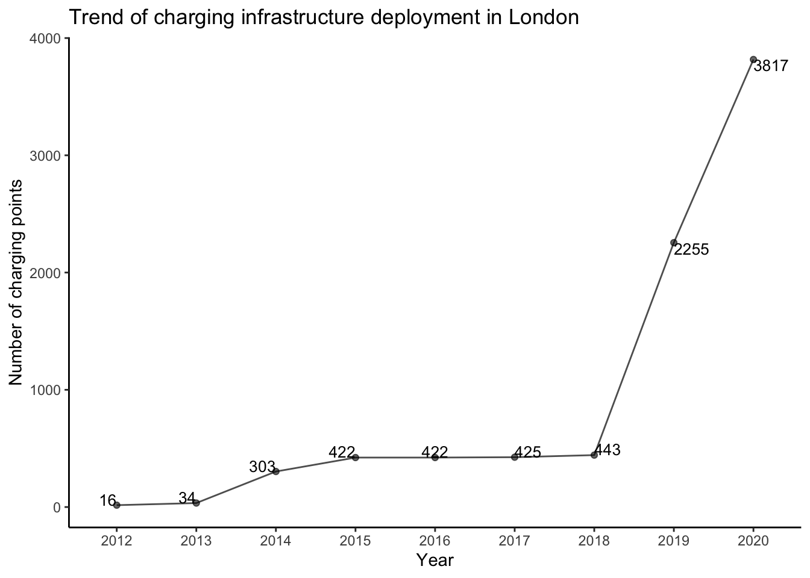

```r
ggsave("pic/charge points trend.jpg", width = 7, height = 4)
```


```r
londonpoints2018 <- londonPfun("2018-12-31")
londonpoints2019 <- londonPfun("2019-12-31")
londonpoints2020 <- londonPfun("2020-12-31")
```

### Function to map charge point density by wards


```r
pointsjoinedfun <- function(londonpointsyear){
  londonpointsyear <- londonpointsyear
  charge_points_ward <- londonpointsyear[londonwards,]
  
  points_wards <- londonwards%>%
    st_join(charge_points_ward)%>%
    add_count(NAME)%>%
    janitor::clean_names()%>%
    #then density of the points per ward
    mutate(density=(n/hectares)*1000) %>% 
    mutate(id=1) %>% 
    mutate(sumpoints=aggregate(n~id,.,FUN=sum)) %>% 
    mutate(percentage=((n/sumpoints[1, 2]))*100) %>% 
    #select density and other variables 
    dplyr::select(density, percentage, name, gss_code, n) %>% 
    distinct(., gss_code, .keep_all = TRUE)
  
  points_wards <- points_wards %>%                    
    group_by(gss_code) %>%         
    summarise(density=density,
              percentage=percentage,
              wardname=name,
              chargepointcount=n)
  return(points_wards)
}
```

### Save charge points by wards


```r
points_wards <- pointsjoinedfun(londonpoints2020) %>% 
  st_drop_geometry()
```

```
## `summarise()` ungrouping output (override with `.groups` argument)
```

```r
write.table(points_wards,"created datasets/points_wards.csv",row.names=FALSE,col.names=TRUE,sep=",")
```


```r
densityfun <- function(londonpointsyear, number, mode){
  points_wards <- pointsjoinedfun(londonpointsyear)
  tmap_mode(mode)
  breaks = c(0, 20, 30, 40, 50, 60, 200, 400, +Inf) 
  tm <- tm_shape(points_wards) +
    tm_polygons("density",
                breaks=breaks,
                palette=RColorBrewer::brewer.pal(8, "YlOrRd"),
                midpoint=NA) +
    tm_legend(show=FALSE)+
    tm_layout(frame=FALSE)+
    tm_credits(number, position=c(0,0.85), size=1)
  
  return(tm)
}
```

```r
legendfun <- function(londonpointsyear){
  points_wards <- pointsjoinedfun(londonpointsyear)
  
  breaks = c(0, 20, 30, 40, 50, 60, 200, 400, +Inf) 
  legend <- tm_shape(points_wards) +
    tm_polygons("density",
                breaks=breaks,
                palette=RColorBrewer::brewer.pal(8, "YlOrRd"), 
                title="Density of Charge Points in London \n(per thousand hectare)") +
    tm_scale_bar(position=c(0.4, 0.01), text.size=0.6)+
    tm_compass(north=0, position=c(0.75, 0.3))+
   
    tm_layout(title = "Charge Points Density Trend", 
              legend.title.size=1,
              legend.text.size = 0.6,
              legend.only = TRUE, 
              legend.position=c(0.1,0.1),asp=0.1)
  
  return(legend)
}
```


### Tmap - charge point density by ward


```r
tm1 <- densityfun(londonpoints2018, "a)", "plot")
```

```
## `summarise()` ungrouping output (override with `.groups` argument)
```

```
## tmap mode set to plotting
```

```r
tm2 <- densityfun(londonpoints2019, "b)", "plot")
```

```
## `summarise()` ungrouping output (override with `.groups` argument)
## tmap mode set to plotting
```

```r
tm3 <- densityfun(londonpoints2020, "c)", "plot")
```

```
## `summarise()` ungrouping output (override with `.groups` argument)
## tmap mode set to plotting
```


```r
legend <- legendfun(londonpoints2020)
```

```
## `summarise()` ungrouping output (override with `.groups` argument)
```

```r
t_density <- tmap_arrange(tm1, tm2, tm3, legend, ncol=2)
t_density
```

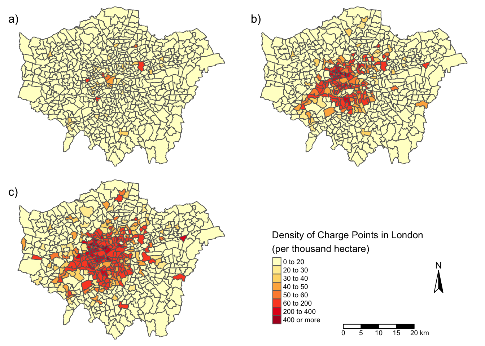

```r
tmap_save(t_density, 'pic/london charge points density.png', width=7, height=4)
```

```
## Map saved to /Users/apple/OneDrive - University College London/Module assessment/CASA_project/casa_project/pic/london charge points density.png
```

```
## Resolution: 2100 by 1200 pixels
```

```
## Size: 7 by 4 inches (300 dpi)
```


```r
tm1v <- densityfun(londonpoints2018, "a)", "view")
```

```
## `summarise()` ungrouping output (override with `.groups` argument)
```

```
## tmap mode set to interactive viewing
```

```r
tm2v <- densityfun(londonpoints2019, "b)", "view")
```

```
## `summarise()` ungrouping output (override with `.groups` argument)
## tmap mode set to interactive viewing
```

```r
tm3v <- densityfun(londonpoints2020, "c)", "view")
```

```
## `summarise()` ungrouping output (override with `.groups` argument)
## tmap mode set to interactive viewing
```


```r
legend <- legendfun(londonpoints2020)
```

```
## `summarise()` ungrouping output (override with `.groups` argument)
```

```r
t_densityv <- tmap_arrange(tm1v, tm2v, tm3v, ncol=1)
t_densityv
```

```
## Credits not supported in view mode.
```

```
## Credits not supported in view mode.
## Credits not supported in view mode.
```

preserve552d45be2fd9bcb1


<!--chapter:end:02-descriptive-analysis.Rmd-->

# Spatial Autocorrelation Analysis

Considering the spatial lags of variables, variables in neighboring geographical units could be calculated, following the first order queen contiguity strategy, which classifies neighbors of geographical units by the sharing of either point or line segment borders. Followed by that, Global Moran’s I and Local Moran’s I statistics for charge points in London could be conducted. 


## Run Global Moran's I

### Function to calculate the centroids


```r
# library(spdep)
# First calculate the centroids of all Wards in London

coordsWfun <- function(londonpointsyear){
  points_wards <- pointsjoinedfun(londonpointsyear)
  coordsW <- points_wards %>% 
    st_centroid() %>%
    st_geometry()
}
```

```r
# test
coordsW <- coordsWfun(londonpoints2020)
```

```
## `summarise()` ungrouping output (override with `.groups` argument)
```

```
## Warning in st_centroid.sf(.): st_centroid assumes attributes are constant over geometries of x
```

```r
plot(coordsW,axes=TRUE)
```

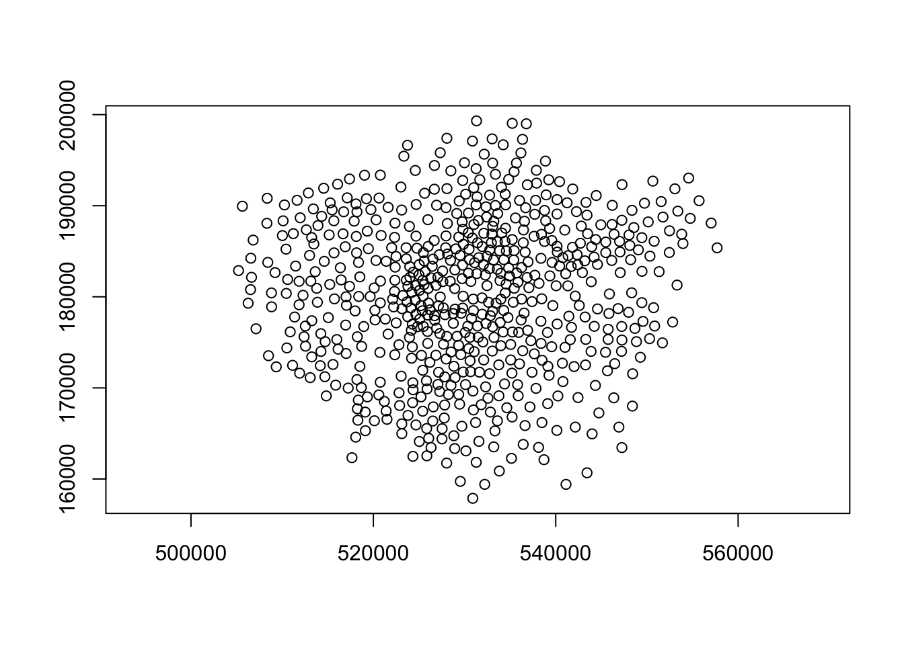


### Function to create a neighbours list


```r
#create a neighbours list
ward_nbfun <- function(londonpointsyear){
  points_wards <- pointsjoinedfun(londonpointsyear)
  ward_nb <- points_wards %>% 
    poly2nb(., queen=T)
  return(ward_nb)
}
```

```r
# test
ward_nb20 <- ward_nbfun(londonpoints2020)
```

```
## `summarise()` ungrouping output (override with `.groups` argument)
```

```r
plot(ward_nb20, st_geometry(coordsW), col="red")
# add a map underneath
points_wards <- pointsjoinedfun(londonpoints2020) 
```

```
## `summarise()` ungrouping output (override with `.groups` argument)
```

```r
plot(points_wards$geometry, add=T)
```

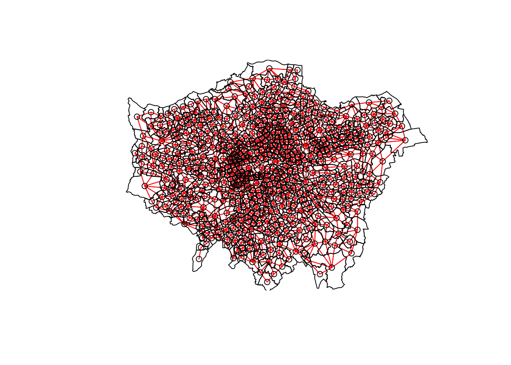

### Function to create spatial weights


```r
#create a spatial weights object from these weights
ward_lwfun <- function(londonpointsyear){
  ward_lw <- ward_nbfun(londonpointsyear) %>% 
    nb2listw(., style="C")
  return(ward_lw)
}
```

```r
# test
ward_lw20 <- ward_lwfun(londonpoints2020)
```

```
## `summarise()` ungrouping output (override with `.groups` argument)
```

```r
head(ward_lw20$neighbours)
```

```
## [[1]]
## [1]   6   7  10 462 468 482
## 
## [[2]]
## [1]  5  8  9 11 12 13 16
## 
## [[3]]
## [1]  10  11  12  15 480 483
## 
## [[4]]
## [1]  17 281 291 470 473 481
## 
## [[5]]
## [1]   2   9  16 281 283 290
## 
## [[6]]
## [1]  1  7  8 10 11 14
```


### Function to run Global Moran's I


```r
I_ward_globalfun <- function(londonpointsyear){
  ward_lw <- ward_lwfun(londonpointsyear)
  
  I_ward_global <- londonpointsyear %>% 
    pointsjoinedfun(.) %>% 
    pull(density) %>%
    as.vector()%>% # Converts a distributed matrix into a non-distributed vector
    moran.test(., ward_lw) # density <-> spatial (similar or not)
  return(I_ward_global)
}
```


### Global Moran's I for 2018, 2019, 2020


```r
I_ward_global18 <- I_ward_globalfun(londonpoints2018)
```

```
## `summarise()` ungrouping output (override with `.groups` argument)
## `summarise()` ungrouping output (override with `.groups` argument)
```

```r
I_ward_global19 <- I_ward_globalfun(londonpoints2019)
```

```
## `summarise()` ungrouping output (override with `.groups` argument)
## `summarise()` ungrouping output (override with `.groups` argument)
```

```r
I_ward_global20 <- I_ward_globalfun(londonpoints2020)
```

```
## `summarise()` ungrouping output (override with `.groups` argument)
## `summarise()` ungrouping output (override with `.groups` argument)
```

```r
I_ward_global18
```

```
## 
## 	Moran I test under randomisation
## 
## data:  .  
## weights: ward_lw    
## 
## Moran I statistic standard deviate = 11.54, p-value < 2.2e-16
## alternative hypothesis: greater
## sample estimates:
## Moran I statistic       Expectation          Variance 
##      0.2589508028     -0.0016025641      0.0005097484
```

```r
I_ward_global19
```

```
## 
## 	Moran I test under randomisation
## 
## data:  .  
## weights: ward_lw    
## 
## Moran I statistic standard deviate = 23.078, p-value < 2.2e-16
## alternative hypothesis: greater
## sample estimates:
## Moran I statistic       Expectation          Variance 
##      0.5238081425     -0.0016025641      0.0005183155
```

```r
I_ward_global20
```

```
## 
## 	Moran I test under randomisation
## 
## data:  .  
## weights: ward_lw    
## 
## Moran I statistic standard deviate = 25.345, p-value < 2.2e-16
## alternative hypothesis: greater
## sample estimates:
## Moran I statistic       Expectation          Variance 
##       0.579937112      -0.001602564       0.000526483
```


## Run Local Moran's I

### Function to run Local Moran's I


```r
ward_lw20 <- ward_lwfun(londonpoints2020)
```

```
## `summarise()` ungrouping output (override with `.groups` argument)
```

```r
  I_ward_local_count <- londonpoints2020 %>% 
    pointsjoinedfun(.) %>% 
    pull(chargepointcount) %>%
    as.vector()%>% 
    localmoran(., ward_lw20) %>% 
    as_tibble()
```

```
## `summarise()` ungrouping output (override with `.groups` argument)
```

```r
  I_ward_local_density <- londonpoints2020 %>% 
    pointsjoinedfun(.) %>% 
    pull(density) %>%
    as.vector()%>% 
    localmoran(., ward_lw20) %>% 
    as_tibble()
```

```
## `summarise()` ungrouping output (override with `.groups` argument)
```

```r
slice_head(I_ward_local_count, n=5)
```

```
## # A tibble: 5 x 5
##   Ii         E.Ii         Var.Ii     Z.Ii        `Pr(z > 0)`
##   <localmrn> <localmrn>   <localmrn> <localmrn>  <localmrn> 
## 1 -0.0152550 -0.001633048 0.1694194  -0.03309466 0.5132004  
## 2 -0.1351878 -0.001905222 0.1973404  -0.30003036 0.6179230  
## 3  0.4127932 -0.001633048 0.1694194   1.00685228 0.1570029  
## 4  0.3218993 -0.001633048 0.1694194   0.78602481 0.2159265  
## 5 -0.1455548 -0.001633048 0.1694194  -0.34965929 0.6367028
```

```r
slice_head(I_ward_local_density, n=5)
```

```
## # A tibble: 5 x 5
##   Ii          E.Ii         Var.Ii     Z.Ii        `Pr(z > 0)`
##   <localmrn>  <localmrn>   <localmrn> <localmrn>  <localmrn> 
## 1 -0.02311287 -0.001633048 0.1675912  -0.05246928 0.5209226  
## 2  0.09282148 -0.001905222 0.1952145   0.21439584 0.4151192  
## 3  0.25021517 -0.001633048 0.1675912   0.61519570 0.2692127  
## 4  0.27698598 -0.001633048 0.1675912   0.68058939 0.2480657  
## 5  0.07334936 -0.001633048 0.1675912   0.18316134 0.4273357
```


```r
# use the local moran function to generate I for each ward in the city

I_ward_localfun <- function(londonpointsyear){
  ward_lw <- ward_lwfun(londonpointsyear)
  
  I_ward_local_count <- londonpointsyear %>% 
    pointsjoinedfun(.) %>% 
    pull(chargepointcount) %>%
    as.vector()%>% 
    localmoran(., ward_lw) %>% 
    as_tibble()
  I_ward_local_density <- londonpointsyear %>% 
    pointsjoinedfun(.) %>% 
    pull(density) %>%
    as.vector()%>% 
    localmoran(., ward_lw) %>% 
    as_tibble()
  
  tm_local_moran <- londonpointsyear %>% 
    pointsjoinedfun(.) %>%
    mutate(charge_count_I = as.numeric(I_ward_local_count$Ii))%>%
    mutate(charge_count_Iz =as.numeric(I_ward_local_count$Z.Ii))%>%
    mutate(density_I =as.numeric(I_ward_local_density$Ii))%>%
    mutate(density_Iz =as.numeric(I_ward_local_density$Z.Ii))
  
  return(tm_local_moran)
}
```


### Function to run tmap for Local Moran's I


```r
tmap_local_moranfun <- function(londonpointsyear, number, mode){
  breaks1<-c(-1000,-2.58,-1.96,-1.65,1.65,1.96,2.58,1000)
  MoranColours<- rev(brewer.pal(8, "RdBu"))
  tm_local_moran <- I_ward_localfun(londonpointsyear)
  tmap_mode(mode)
  tmap <- tm_shape(tm_local_moran) +
    tm_polygons("charge_count_Iz",
        style="fixed",
        breaks=breaks1,
        palette=MoranColours,
        midpoint=NA)+
    tm_legend(show=FALSE)+
    tm_layout(frame=FALSE)+
    tm_credits(number, position=c(0,0.85), size=1)
  return(tmap)
}
```

```r
tmap_moranlegendfun <- function(londonpointsyear){
  breaks1<-c(-1000,-2.58,-1.96,-1.65,1.65,1.96,2.58,1000)
  MoranColours<- rev(brewer.pal(8, "RdBu"))
  tm_local_moran <- I_ward_localfun(londonpointsyear)
  legend <- tm_shape(tm_local_moran) +
    tm_polygons("charge_count_Iz",
                breaks=breaks1,
                palette=MoranColours,
                title="Local Moran's I, Charge Points in London") +
    tm_scale_bar(position=c(0.1,0.04), text.size=0.6)+
    tm_compass(north=0, position=c(0.65,0.2))+
   
    tm_layout(title = "Charge Points Local Moran's I", 
              legend.title.size=1,
              legend.text.size = 0.6,
              legend.only = TRUE, 
              legend.position=c(0.1,0.25),asp=0.1)
  
  return(legend)
}
```


```r
tm_local_moran18 <- tmap_local_moranfun(londonpoints2018, "a)", "plot")
```

```
## `summarise()` ungrouping output (override with `.groups` argument)
## `summarise()` ungrouping output (override with `.groups` argument)
## `summarise()` ungrouping output (override with `.groups` argument)
## `summarise()` ungrouping output (override with `.groups` argument)
```

```
## tmap mode set to plotting
```

```r
tm_local_moran19 <- tmap_local_moranfun(londonpoints2019, "b)", "plot")
```

```
## `summarise()` ungrouping output (override with `.groups` argument)
```

```
## `summarise()` ungrouping output (override with `.groups` argument)
## `summarise()` ungrouping output (override with `.groups` argument)
## `summarise()` ungrouping output (override with `.groups` argument)
```

```
## tmap mode set to plotting
```

```r
tm_local_moran20 <- tmap_local_moranfun(londonpoints2020, "c)", "plot")
```

```
## `summarise()` ungrouping output (override with `.groups` argument)
```

```
## `summarise()` ungrouping output (override with `.groups` argument)
## `summarise()` ungrouping output (override with `.groups` argument)
## `summarise()` ungrouping output (override with `.groups` argument)
```

```
## tmap mode set to plotting
```

```r
moran_legend <- tmap_moranlegendfun(londonpoints2020)
```

```
## `summarise()` ungrouping output (override with `.groups` argument)
## `summarise()` ungrouping output (override with `.groups` argument)
## `summarise()` ungrouping output (override with `.groups` argument)
## `summarise()` ungrouping output (override with `.groups` argument)
```

```r
local_moran <- tmap_arrange(tm_local_moran18, 
                            tm_local_moran19, 
                            tm_local_moran20, 
                            moran_legend, ncol=2)
local_moran
```

```
## Variable(s) "charge_count_Iz" contains positive and negative values, so midpoint is set to 0. Set midpoint = NA to show the full spectrum of the color palette.
```

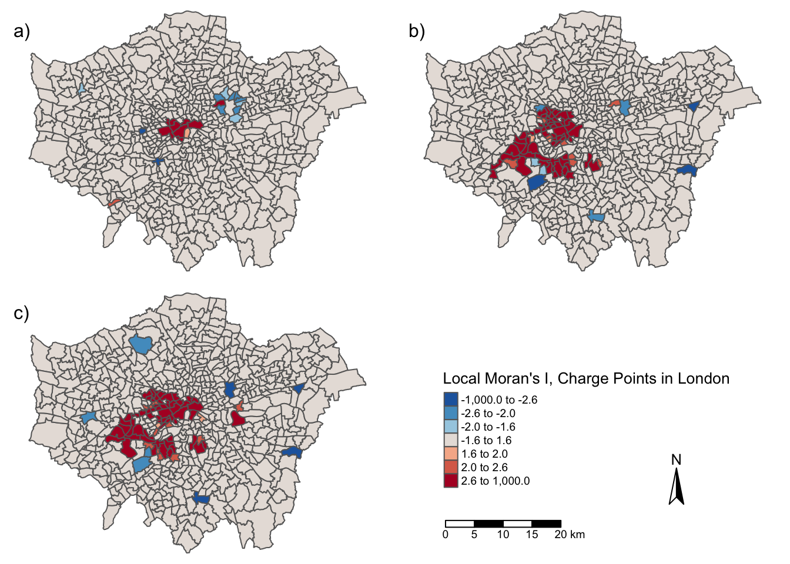


```r
tmap_save(local_moran, "pic/Local Moran's I, Charge Points in London.png",width=7, height=4)
```

```
## Variable(s) "charge_count_Iz" contains positive and negative values, so midpoint is set to 0. Set midpoint = NA to show the full spectrum of the color palette.
```

```
## Map saved to /Users/apple/OneDrive - University College London/Module assessment/CASA_project/casa_project/pic/Local Moran's I, Charge Points in London.png
```

```
## Resolution: 2100 by 1200 pixels
```

```
## Size: 7 by 4 inches (300 dpi)
```

```r
tm_local_moran18v <- tmap_local_moranfun(londonpoints2018, "a)", "view")
```

```
## `summarise()` ungrouping output (override with `.groups` argument)
## `summarise()` ungrouping output (override with `.groups` argument)
## `summarise()` ungrouping output (override with `.groups` argument)
## `summarise()` ungrouping output (override with `.groups` argument)
```

```
## tmap mode set to interactive viewing
```

```r
tm_local_moran19v <- tmap_local_moranfun(londonpoints2019, "b)", "view")
```

```
## `summarise()` ungrouping output (override with `.groups` argument)
```

```
## `summarise()` ungrouping output (override with `.groups` argument)
## `summarise()` ungrouping output (override with `.groups` argument)
## `summarise()` ungrouping output (override with `.groups` argument)
```

```
## tmap mode set to interactive viewing
```

```r
tm_local_moran20v <- tmap_local_moranfun(londonpoints2020, "c)", "view")
```

```
## `summarise()` ungrouping output (override with `.groups` argument)
```

```
## `summarise()` ungrouping output (override with `.groups` argument)
## `summarise()` ungrouping output (override with `.groups` argument)
## `summarise()` ungrouping output (override with `.groups` argument)
```

```
## tmap mode set to interactive viewing
```

```r
moran_legend <- tmap_moranlegendfun(londonpoints2020)
```

```
## `summarise()` ungrouping output (override with `.groups` argument)
## `summarise()` ungrouping output (override with `.groups` argument)
## `summarise()` ungrouping output (override with `.groups` argument)
## `summarise()` ungrouping output (override with `.groups` argument)
```

```r
local_moran <- tmap_arrange(tm_local_moran18v, 
                            tm_local_moran19v, 
                            tm_local_moran20v, ncol=1)
local_moran
```

```
## Credits not supported in view mode.
```

```
## Credits not supported in view mode.
## Credits not supported in view mode.
```

preserve0d8a7409070e8db2


### Function to run Gi*


```r
Gi_ward_local_densityfun <- function(londonpointsyear){
  ward_lw <- ward_lwfun(londonpointsyear)
  
  Gi_ward_local_density <- londonpointsyear %>% 
    pointsjoinedfun(.) %>% 
    pull(density) %>%
    as.vector()%>%
    localG(., ward_lw)
  
  density_Gi <- londonpointsyear %>% 
    pointsjoinedfun(.) %>% 
    mutate(density_G = as.numeric(Gi_ward_local_density))
  
  return(density_Gi)
}
```


### Function to run tmap for Gi*


```r
tmap_Gifun <- function(londonpointsyear, number, mode){
  breaks1<-c(-1000,-2.58,-1.96,-1.65,1.65,1.96,2.58,1000)
  GIColours<- rev(brewer.pal(8, "RdBu"))
  density_Gi <- Gi_ward_local_densityfun(londonpointsyear)
  tmap_mode(mode)
  tmap <- tm_shape(density_Gi) +
    tm_polygons("density_G",
                breaks=breaks1,
                palette=GIColours,
                title="Gi*, Charge Points in London") +
    tm_legend(show=FALSE)+
    tm_layout(frame=FALSE)+
    tm_credits(number, position=c(0,0.85), size=1)
  
  return(tmap)
}
```


```r
G1 <- tmap_Gifun(londonpoints2018, "a)", "plot")
```

```
## `summarise()` ungrouping output (override with `.groups` argument)
## `summarise()` ungrouping output (override with `.groups` argument)
## `summarise()` ungrouping output (override with `.groups` argument)
```

```
## tmap mode set to plotting
```

```r
G2 <- tmap_Gifun(londonpoints2019, "b)", "plot")
```

```
## `summarise()` ungrouping output (override with `.groups` argument)
```

```
## `summarise()` ungrouping output (override with `.groups` argument)
## `summarise()` ungrouping output (override with `.groups` argument)
```

```
## tmap mode set to plotting
```

```r
G3 <- tmap_Gifun(londonpoints2020, "c)", "plot")
```

```
## `summarise()` ungrouping output (override with `.groups` argument)
```

```
## `summarise()` ungrouping output (override with `.groups` argument)
## `summarise()` ungrouping output (override with `.groups` argument)
```

```
## tmap mode set to plotting
```


```r
tmap_Gilegendfun <- function(londonpointsyear){
  breaks1<-c(-1000,-2.58,-1.96,-1.65,1.65,1.96,2.58,1000)
  GIColours<- rev(brewer.pal(8, "RdBu"))
  density_Gi <- Gi_ward_local_densityfun(londonpointsyear)
  legend <- tm_shape(density_Gi) +
    tm_polygons("density_G",
                breaks=breaks1,
                palette=GIColours,
                title="Gi*, Charge Points in London") +
    tm_scale_bar(position=c(0.1,0.04), text.size=0.6)+
    tm_compass(north=0, position=c(0.65,0.2))+
   
    tm_layout(title = "Charge Points Gi* Density", 
              legend.title.size=1,
              legend.text.size = 0.6,
              legend.only = TRUE, 
              legend.position=c(0.1,0.25),asp=0.1)
  
  return(legend)
}
```

```r
Gi_legend <- tmap_Gilegendfun(londonpoints2020)
```

```
## `summarise()` ungrouping output (override with `.groups` argument)
## `summarise()` ungrouping output (override with `.groups` argument)
## `summarise()` ungrouping output (override with `.groups` argument)
```

```r
Gi <- tmap_arrange(G1, G2, G3, Gi_legend, ncol=2)
Gi
```

```
## Variable(s) "density_G" contains positive and negative values, so midpoint is set to 0. Set midpoint = NA to show the full spectrum of the color palette.
```

```
## Variable(s) "density_G" contains positive and negative values, so midpoint is set to 0. Set midpoint = NA to show the full spectrum of the color palette.
## Variable(s) "density_G" contains positive and negative values, so midpoint is set to 0. Set midpoint = NA to show the full spectrum of the color palette.
## Variable(s) "density_G" contains positive and negative values, so midpoint is set to 0. Set midpoint = NA to show the full spectrum of the color palette.
```

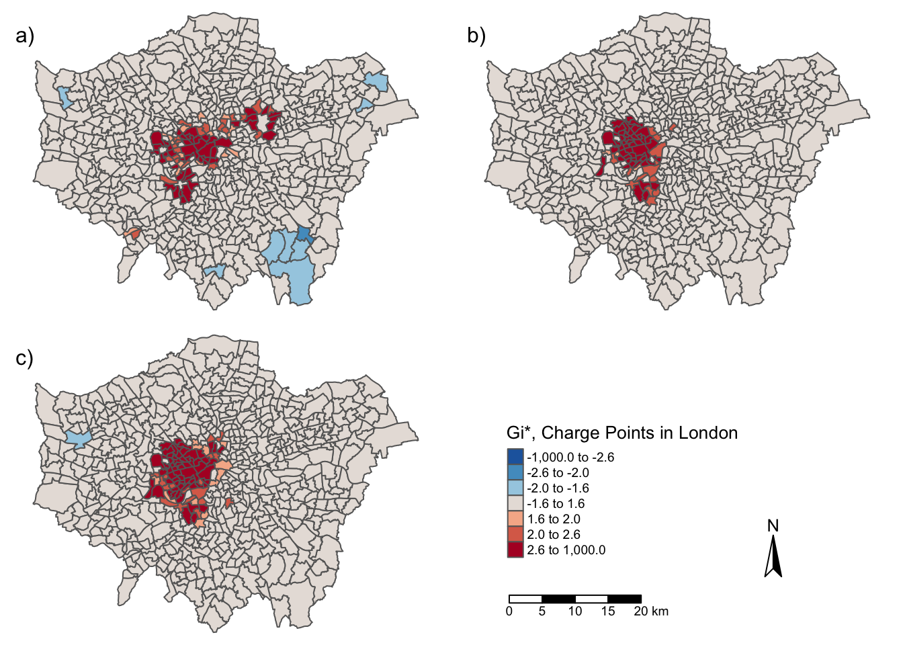

```r
tmap_save(local_moran, "pic/Gi, Charge Points in London.png",width=7, height=4)
```

```
## Map saved to /Users/apple/OneDrive - University College London/Module assessment/CASA_project/casa_project/pic/Gi, Charge Points in London.png
```

```
## Resolution: 2100 by 1200 pixels
```

```
## Size: 7 by 4 inches (300 dpi)
```

<!--chapter:end:03-spatial-autocorrelation.Rmd-->


# Statistical Correlation Analysis

There are several characteristics are considered to contribute to the density of charge points (CD) and its utilization rates (UR), including socio-demographic, travel-related and land-use characteristics. In specific, they are employment rate (ER), house price (HP), public transit score (PS), which could reflect the level of local public transport), parking density (PD), percentage of residential area (RSP) and percentage of road area (RP). 

## Load packages


### Load plot library


```r
library(Rmisc) 
```

```
## Loading required package: lattice
```

```
## Loading required package: plyr
```

```
## --------------------------------------------------------------------------------------------------
```

```
## You have loaded plyr after dplyr - this is likely to cause problems.
## If you need functions from both plyr and dplyr, please load plyr first, then dplyr:
## library(plyr); library(dplyr)
```

```
## --------------------------------------------------------------------------------------------------
```

```
## 
## Attaching package: 'plyr'
```

```
## The following objects are masked from 'package:dplyr':
## 
##     arrange, count, desc, failwith, id, mutate, rename, summarise, summarize
```

```
## The following object is masked from 'package:purrr':
## 
##     compact
```

```r
library(plyr)
```

### Load model library


```r
library(stats)
library(corrr)
library(car)
```

```
## Loading required package: carData
```

```
## 
## Attaching package: 'car'
```

```
## The following object is masked from 'package:dplyr':
## 
##     recode
```

```
## The following object is masked from 'package:purrr':
## 
##     some
```

```r
library(spatstat)
```

```
## Loading required package: spatstat.data
```

```
## Loading required package: nlme
```

```
## 
## Attaching package: 'nlme'
```

```
## The following object is masked from 'package:dplyr':
## 
##     collapse
```

```
## Loading required package: rpart
```

```
## Registered S3 method overwritten by 'spatstat':
##   method     from
##   print.boxx cli
```

```
## 
## spatstat 1.64-1       (nickname: 'Help you I can, yes!') 
## For an introduction to spatstat, type 'beginner'
```

```
## 
## Note: spatstat version 1.64-1 is out of date by more than 8 months; we recommend upgrading to the latest version.
```

```
## 
## Attaching package: 'spatstat'
```

```
## The following object is masked _by_ '.GlobalEnv':
## 
##     densityfun
```

```
## The following objects are masked from 'package:car':
## 
##     bc, ellipse
```

```
## The following object is masked from 'package:lattice':
## 
##     panel.histogram
```

```r
library(tidymodels)
```

```
## ── Attaching packages ────────────────────────────────────────────────────────── tidymodels 0.1.2 ──
```

```
## ✓ broom     0.7.2      ✓ recipes   0.1.15
## ✓ dials     0.0.9      ✓ rsample   0.0.8 
## ✓ infer     0.5.3      ✓ tune      0.1.2 
## ✓ modeldata 0.1.0      ✓ workflows 0.2.1 
## ✓ parsnip   0.1.4      ✓ yardstick 0.0.7
```

```
## ── Conflicts ───────────────────────────────────────────────────────────── tidymodels_conflicts() ──
## x plyr::arrange()      masks dplyr::arrange()
## x nlme::collapse()     masks dplyr::collapse()
## x plyr::compact()      masks purrr::compact()
## x plyr::count()        masks dplyr::count()
## x scales::discard()    masks purrr::discard()
## x plyr::failwith()     masks dplyr::failwith()
## x dplyr::filter()      masks stats::filter()
## x recipes::fixed()     masks stringr::fixed()
## x plyr::id()           masks dplyr::id()
## x dplyr::lag()         masks stats::lag()
## x plyr::mutate()       masks dplyr::mutate()
## x tune::parameters()   masks dials::parameters(), spatstat::parameters()
## x dials::prune()       masks rpart::prune()
## x car::recode()        masks dplyr::recode()
## x plyr::rename()       masks dplyr::rename()
## x car::some()          masks purrr::some()
## x yardstick::spec()    masks readr::spec()
## x recipes::step()      masks stats::step()
## x plyr::summarise()    masks dplyr::summarise()
## x plyr::summarize()    masks dplyr::summarize()
## x parsnip::translate() masks rgeos::translate()
```

```r
library(spatialreg)
```

```
## Loading required package: Matrix
```

```
## 
## Attaching package: 'Matrix'
```

```
## The following objects are masked from 'package:tidyr':
## 
##     expand, pack, unpack
```

```
## Registered S3 methods overwritten by 'spatialreg':
##   method                   from 
##   residuals.stsls          spdep
##   deviance.stsls           spdep
##   coef.stsls               spdep
##   print.stsls              spdep
##   summary.stsls            spdep
##   print.summary.stsls      spdep
##   residuals.gmsar          spdep
##   deviance.gmsar           spdep
##   coef.gmsar               spdep
##   fitted.gmsar             spdep
##   print.gmsar              spdep
##   summary.gmsar            spdep
##   print.summary.gmsar      spdep
##   print.lagmess            spdep
##   summary.lagmess          spdep
##   print.summary.lagmess    spdep
##   residuals.lagmess        spdep
##   deviance.lagmess         spdep
##   coef.lagmess             spdep
##   fitted.lagmess           spdep
##   logLik.lagmess           spdep
##   fitted.SFResult          spdep
##   print.SFResult           spdep
##   fitted.ME_res            spdep
##   print.ME_res             spdep
##   print.lagImpact          spdep
##   plot.lagImpact           spdep
##   summary.lagImpact        spdep
##   HPDinterval.lagImpact    spdep
##   print.summary.lagImpact  spdep
##   print.sarlm              spdep
##   summary.sarlm            spdep
##   residuals.sarlm          spdep
##   deviance.sarlm           spdep
##   coef.sarlm               spdep
##   vcov.sarlm               spdep
##   fitted.sarlm             spdep
##   logLik.sarlm             spdep
##   anova.sarlm              spdep
##   predict.sarlm            spdep
##   print.summary.sarlm      spdep
##   print.sarlm.pred         spdep
##   as.data.frame.sarlm.pred spdep
##   residuals.spautolm       spdep
##   deviance.spautolm        spdep
##   coef.spautolm            spdep
##   fitted.spautolm          spdep
##   print.spautolm           spdep
##   summary.spautolm         spdep
##   logLik.spautolm          spdep
##   print.summary.spautolm   spdep
##   print.WXImpact           spdep
##   summary.WXImpact         spdep
##   print.summary.WXImpact   spdep
##   predict.SLX              spdep
```

```
## 
## Attaching package: 'spatialreg'
```

```
## The following objects are masked from 'package:spdep':
## 
##     anova.sarlm, as_dgRMatrix_listw, as_dsCMatrix_I, as_dsCMatrix_IrW,
##     as_dsTMatrix_listw, as.spam.listw, bptest.sarlm, can.be.simmed, cheb_setup,
##     coef.gmsar, coef.sarlm, coef.spautolm, coef.stsls, create_WX, deviance.gmsar,
##     deviance.sarlm, deviance.spautolm, deviance.stsls, do_ldet, eigen_pre_setup,
##     eigen_setup, eigenw, errorsarlm, fitted.gmsar, fitted.ME_res, fitted.sarlm,
##     fitted.SFResult, fitted.spautolm, get.ClusterOption, get.coresOption, get.mcOption,
##     get.VerboseOption, get.ZeroPolicyOption, GMargminImage, GMerrorsar, griffith_sone,
##     gstsls, Hausman.test, HPDinterval.lagImpact, impacts, intImpacts, Jacobian_W,
##     jacobianSetup, l_max, lagmess, lagsarlm, lextrB, lextrS, lextrW, lmSLX, logLik.sarlm,
##     logLik.spautolm, LR.sarlm, LR1.sarlm, LR1.spautolm, LU_prepermutate_setup, LU_setup,
##     Matrix_J_setup, Matrix_setup, mcdet_setup, MCMCsamp, ME, mom_calc, mom_calc_int2,
##     moments_setup, powerWeights, predict.sarlm, predict.SLX, print.gmsar, print.ME_res,
##     print.sarlm, print.sarlm.pred, print.SFResult, print.spautolm, print.stsls,
##     print.summary.gmsar, print.summary.sarlm, print.summary.spautolm,
##     print.summary.stsls, residuals.gmsar, residuals.sarlm, residuals.spautolm,
##     residuals.stsls, sacsarlm, SE_classic_setup, SE_interp_setup, SE_whichMin_setup,
##     set.ClusterOption, set.coresOption, set.mcOption, set.VerboseOption,
##     set.ZeroPolicyOption, similar.listw, spam_setup, spam_update_setup, SpatialFiltering,
##     spautolm, spBreg_err, spBreg_lag, spBreg_sac, stsls, subgraph_eigenw, summary.gmsar,
##     summary.sarlm, summary.spautolm, summary.stsls, trW, vcov.sarlm, Wald1.sarlm
```

## Load files

### Load London wards shapefile


```r
londonwards <- st_read("datasets/wards/London_Ward_CityMerged.shp") %>% 
  st_transform(., 27700)
```

```
## Reading layer `London_Ward_CityMerged' from data source `/Users/apple/OneDrive - University College London/Module assessment/CASA_project/casa_project/datasets/wards/London_Ward_CityMerged.shp' using driver `ESRI Shapefile'
## Simple feature collection with 625 features and 7 fields
## geometry type:  POLYGON
## dimension:      XY
## bbox:           xmin: 503568.2 ymin: 155850.8 xmax: 561957.5 ymax: 200933.9
## projected CRS:  OSGB 1936 / British National Grid
```


### Load points in wards


```r
points_wards <- read_csv("created datasets/points_wards.csv")
```

```
## 
## ── Column specification ────────────────────────────────────────────────────────────────────────────
## cols(
##   gss_code = col_character(),
##   density = col_double(),
##   percentage = col_double(),
##   wardname = col_character(),
##   chargepointcount = col_double()
## )
```

```r
summary(points_wards)
```

```
##    gss_code            density           percentage         wardname         chargepointcount
##  Length:625         Min.   :  0.3444   Min.   :0.001479   Length:625         Min.   : 1.000  
##  Class :character   1st Qu.:  5.8152   1st Qu.:0.001479   Class :character   1st Qu.: 1.000  
##  Mode  :character   Median : 15.6903   Median :0.004436   Mode  :character   Median : 3.000  
##                     Mean   : 50.7528   Mean   :0.010053                      Mean   : 6.798  
##                     3rd Qu.: 58.0526   3rd Qu.:0.011830                      3rd Qu.: 8.000  
##                     Max.   :686.6051   Max.   :0.075417                      Max.   :51.000
```


### Load wards profile

Load London wards profile as the basic data frame for correlation analysis


```r
ward_profile <- read_csv("datasets/ward_profiles.csv",
                         col_types = cols(
                           "New code" = col_character(),
                           "% All Working-age (16-64) - 2015"= col_number(),
                           "Population density (persons per sq km) - 2013"= col_number(),
                           "Number Killed or Seriously Injured on the roads - 2014" = col_number(),
                           "Employment rate (16-64) - 2011" = col_number(),
                           "Median House Price (£) - 2014" = col_number(),
                           "Cars per household - 2011" = col_number(),
                           "Average Public Transport Accessibility score - 2014"= col_number()
                         ))
```

```
## Warning: 6 parsing failures.
## row                                                    col expected                                                                   actual                         file
## 660 Average Public Transport Accessibility score - 2014    a number n/a                                                                      'datasets/ward_profiles.csv'
## 661 % All Working-age (16-64) - 2015                       a number GLA SHLAA Trend based Population Projection data, and Mid year estimates 'datasets/ward_profiles.csv'
## 661 Population density (persons per sq km) - 2013          a number GLA SHLAA Trend based Population Projection data                         'datasets/ward_profiles.csv'
## 661 Number Killed or Seriously Injured on the roads - 2014 a number London Ambulance Service                                                 'datasets/ward_profiles.csv'
## 661 Median House Price (£) - 2014                          a number Land Registry                                                            'datasets/ward_profiles.csv'
## ... ...................................................... ........ ........................................................................ ............................
## See problems(...) for more details.
```

```r
colnames(ward_profile)
```

```
##  [1] "Ward name"                                                                  
##  [2] "Old code"                                                                   
##  [3] "New code"                                                                   
##  [4] "Population - 2015"                                                          
##  [5] "Children aged 0-15 - 2015"                                                  
##  [6] "Working-age (16-64) - 2015"                                                 
##  [7] "Older people aged 65+ - 2015"                                               
##  [8] "% All Children aged 0-15 - 2015"                                            
##  [9] "% All Working-age (16-64) - 2015"                                           
## [10] "% All Older people aged 65+ - 2015"                                         
## [11] "Mean Age - 2013"                                                            
## [12] "Median Age - 2013"                                                          
## [13] "Area - Square Kilometres"                                                   
## [14] "Population density (persons per sq km) - 2013"                              
## [15] "% BAME - 2011"                                                              
## [16] "% Not Born in UK - 2011"                                                    
## [17] "% English is First Language of no one in household - 2011"                  
## [18] "General Fertility Rate - 2013"                                              
## [19] "Male life expectancy -2009-13"                                              
## [20] "Female life expectancy -2009-13"                                            
## [21] "% children in reception year who are obese - 2011/12 to 2013/14"            
## [22] "% children in year 6 who are obese- 2011/12 to 2013/14"                     
## [23] "Rate of All Ambulance Incidents per 1,000 population - 2014"                
## [24] "Rates of ambulance call outs for alcohol related illness - 2014"            
## [25] "Number Killed or Seriously Injured on the roads - 2014"                     
## [26] "In employment (16-64) - 2011"                                               
## [27] "Employment rate (16-64) - 2011"                                             
## [28] "Number of jobs in area - 2013"                                              
## [29] "Employment per head of resident WA population - 2013"                       
## [30] "Rate of new registrations of migrant workers - 2011/12"                     
## [31] "Median House Price (£) - 2014"                                              
## [32] "Number of properties sold - 2014"                                           
## [33] "Median Household income estimate (2012/13)"                                 
## [34] "Number of Household spaces - 2011"                                          
## [35] "% detached houses - 2011"                                                   
## [36] "% semi-detached houses - 2011"                                              
## [37] "% terraced houses - 2011"                                                   
## [38] "% Flat, maisonette or apartment - 2011"                                     
## [39] "% Households Owned - 2011"                                                  
## [40] "% Households Social Rented - 2011"                                          
## [41] "% Households Private Rented - 2011"                                         
## [42] "% dwellings in council tax bands A or B - 2015"                             
## [43] "% dwellings in council tax bands C, D or E - 2015"                          
## [44] "% dwellings in council tax bands F, G or H - 2015"                          
## [45] "Claimant rate of key out-of-work benefits (working age client group) (2014)"
## [46] "Claimant Rate of Housing Benefit (2015)"                                    
## [47] "Claimant Rate of Employment Support Allowance - 2014"                       
## [48] "Rate of JobSeekers Allowance (JSA) Claimants - 2015"                        
## [49] "% dependent children (0-18) in out-of-work households - 2014"               
## [50] "% of households with no adults in employment with dependent children - 2011"
## [51] "% of lone parents not in employment - 2011"                                 
## [52] "(ID2010) - Rank of average score (within London) - 2010"                    
## [53] "(ID2010) % of LSOAs in worst 50% nationally - 2010"                         
## [54] "Average GCSE capped point scores - 2014"                                    
## [55] "Unauthorised Absence in All Schools (%) - 2013"                             
## [56] "% with no qualifications - 2011"                                            
## [57] "% with Level 4 qualifications and above - 2011"                             
## [58] "A-Level Average Point Score Per Student - 2013/14"                          
## [59] "A-Level Average Point Score Per Entry; 2013/14"                             
## [60] "Crime rate - 2014/15"                                                       
## [61] "Violence against the person rate - 2014/15"                                 
## [62] "Deliberate Fires per 1,000 population - 2014"                               
## [63] "% area that is open space - 2014"                                           
## [64] "Cars per household - 2011"                                                  
## [65] "Average Public Transport Accessibility score - 2014"                        
## [66] "% travel by bicycle to work - 2011"                                         
## [67] "Turnout at Mayoral election - 2012"
```

```r
head(ward_profile)
```

```
## # A tibble: 6 x 67
##   `Ward name` `Old code` `New code` `Population - 2… `Children aged … `Working-age (1…
##   <chr>       <chr>      <chr>      <chr>            <chr>            <chr>           
## 1 City of Lo… 00AA       E09000001  8,100            650              6,250           
## 2 Barking an… 00ABFX     E05000026  14,750           3,850            10,150          
## 3 Barking an… 00ABFY     E05000027  10,600           2,700            6,800           
## 4 Barking an… 00ABFZ     E05000028  12,700           3,200            8,350           
## 5 Barking an… 00ABGA     E05000029  10,400           2,550            6,400           
## 6 Barking an… 00ABGB     E05000030  10,750           2,150            7,050           
## # … with 61 more variables: `Older people aged 65+ - 2015` <chr>, `% All Children aged 0-15 -
## #   2015` <chr>, `% All Working-age (16-64) - 2015` <dbl>, `% All Older people aged 65+ -
## #   2015` <chr>, `Mean Age - 2013` <chr>, `Median Age - 2013` <chr>, `Area - Square
## #   Kilometres` <chr>, `Population density (persons per sq km) - 2013` <dbl>, `% BAME -
## #   2011` <chr>, `% Not Born in UK - 2011` <chr>, `% English is First Language of no one in
## #   household - 2011` <chr>, `General Fertility Rate - 2013` <chr>, `Male life expectancy
## #   -2009-13` <chr>, `Female life expectancy -2009-13` <chr>, `% children in reception year who are
## #   obese - 2011/12 to 2013/14` <chr>, `% children in year 6 who are obese- 2011/12 to
## #   2013/14` <chr>, `Rate of All Ambulance Incidents per 1,000 population - 2014` <chr>, `Rates of
## #   ambulance call outs for alcohol related illness - 2014` <chr>, `Number Killed or Seriously
## #   Injured on the roads - 2014` <dbl>, `In employment (16-64) - 2011` <chr>, `Employment rate
## #   (16-64) - 2011` <dbl>, `Number of jobs in area - 2013` <chr>, `Employment per head of resident
## #   WA population - 2013` <chr>, `Rate of new registrations of migrant workers - 2011/12` <chr>,
## #   `Median House Price (£) - 2014` <dbl>, `Number of properties sold - 2014` <chr>, `Median
## #   Household income estimate (2012/13)` <chr>, `Number of Household spaces - 2011` <chr>, `%
## #   detached houses - 2011` <chr>, `% semi-detached houses - 2011` <chr>, `% terraced houses -
## #   2011` <chr>, `% Flat, maisonette or apartment - 2011` <chr>, `% Households Owned - 2011` <chr>,
## #   `% Households Social Rented - 2011` <chr>, `% Households Private Rented - 2011` <chr>, `%
## #   dwellings in council tax bands A or B - 2015` <chr>, `% dwellings in council tax bands C, D or
## #   E - 2015` <chr>, `% dwellings in council tax bands F, G or H - 2015` <chr>, `Claimant rate of
## #   key out-of-work benefits (working age client group) (2014)` <chr>, `Claimant Rate of Housing
## #   Benefit (2015)` <chr>, `Claimant Rate of Employment Support Allowance - 2014` <chr>, `Rate of
## #   JobSeekers Allowance (JSA) Claimants - 2015` <chr>, `% dependent children (0-18) in out-of-work
## #   households - 2014` <chr>, `% of households with no adults in employment with dependent children
## #   - 2011` <chr>, `% of lone parents not in employment - 2011` <chr>, `(ID2010) - Rank of average
## #   score (within London) - 2010` <chr>, `(ID2010) % of LSOAs in worst 50% nationally -
## #   2010` <chr>, `Average GCSE capped point scores - 2014` <chr>, `Unauthorised Absence in All
## #   Schools (%) - 2013` <chr>, `% with no qualifications - 2011` <chr>, `% with Level 4
## #   qualifications and above - 2011` <chr>, `A-Level Average Point Score Per Student -
## #   2013/14` <chr>, `A-Level Average Point Score Per Entry; 2013/14` <chr>, `Crime rate -
## #   2014/15` <chr>, `Violence against the person rate - 2014/15` <chr>, `Deliberate Fires per 1,000
## #   population - 2014` <chr>, `% area that is open space - 2014` <chr>, `Cars per household -
## #   2011` <dbl>, `Average Public Transport Accessibility score - 2014` <dbl>, `% travel by bicycle
## #   to work - 2011` <chr>, `Turnout at Mayoral election - 2012` <chr>
```


```r
londonward_code <- londonwards %>% 
  st_drop_geometry() %>% 
  clean_names() 
```

```r
londonward_code <- londonward_code %>% 
  dplyr::select(., c(2))
```


```r
wardprofile <- ward_profile %>% 
  dplyr::select(., c(1, 2, 3, 9, 14, 25, 27, 31, 64, 65)) %>% 
  clean_names() %>% 
  group_by(ward_name) %>%         
    summarise(old_code=old_code,
              gss_code=new_code,
              pop_density=population_density_persons_per_sq_km_2013,
              road_incidents=number_killed_or_seriously_injured_on_the_roads_2014,
              employment_rate=employment_rate_16_64_2011,
              houseprice=median_house_price_2014,
              car_ownership=cars_per_household_2011,
              publictransaccess_score=average_public_transport_accessibility_score_2014)%>% 
  merge(londonward_code, .,
        by.x = "gss_code",
        by.y = "gss_code") %>% 
  distinct(.,.keep_all=TRUE)


colnames(wardprofile)
```

```
## [1] "gss_code"                "old_code"                "pop_density"            
## [4] "road_incidents"          "employment_rate"         "houseprice"             
## [7] "car_ownership"           "publictransaccess_score"
```

```r
write.table(wardprofile,"created datasets/wardprofile.csv",row.names=FALSE,col.names=TRUE,sep=",")
```

```r
allcharacter <- points_wards %>% 
  left_join(wardprofile,.,
            by = c("gss_code" = "gss_code"))
```


### Load household.csv


```r
household <- read_csv("datasets/households-type-2001-ward.csv") %>% 
  dplyr::select(., c(1, 3)) %>% 
  clean_names()
```

```
## 
## ── Column specification ────────────────────────────────────────────────────────────────────────────
## cols(
##   `Area code` = col_character(),
##   `Area name` = col_character(),
##   `All Households` = col_double(),
##   `Couple household with dependent children` = col_double(),
##   `Couple household without dependent children` = col_double(),
##   `Lone parent household` = col_double(),
##   `One person household` = col_double(),
##   `Other multi person household` = col_double(),
##   `% Couple household with dependent children` = col_double(),
##   `% Couple household without dependent children` = col_double(),
##   `% Lone parent household` = col_double(),
##   `% One person household` = col_double(),
##   `% Other multi person household` = col_double()
## )
```

```r
summary(household)
```

```
##   area_code         all_households    
##  Length:627         Min.   :    1900  
##  Class :character   1st Qu.:    4203  
##  Mode  :character   Median :    4741  
##                     Mean   :   44167  
##                     3rd Qu.:    5386  
##                     Max.   :21660475
```

Join household dataset to the ward profile data frame


```r
allcharacter <- allcharacter %>% 
  left_join(., household,
            by = c("old_code" = "area_code"))
```


### Load land use.csv


```r
landuse <- read_csv("datasets/land-use-glud-ward.csv") %>% 
  dplyr::select(., c(1, 3, 16, 17, 19, 20, 21)) %>% 
  clean_names() %>% 
  group_by(area_name) %>%         
    summarise(area_code=area_code,
              residential_percentage=percent_area_of_domestic_buildings+percent_area_of_domestic_gardens, road_percentage= percent_area_of_road,
              rail_percentage = percent_area_of_rail,
              path_percentage = percent_area_of_path)
```

```
## 
## ── Column specification ────────────────────────────────────────────────────────────────────────────
## cols(
##   .default = col_double(),
##   `Area Code` = col_character(),
##   `Local Authority Name` = col_character(),
##   `Area name` = col_character(),
##   `Area of Rail` = col_character()
## )
## ℹ Use `spec()` for the full column specifications.
```

```r
summary(landuse)
```

```
##   area_code         residential_percentage road_percentage rail_percentage  path_percentage
##  Length:626         Min.   : 4.30          Min.   : 1.40   Min.   : 0.000   Min.   :0.10   
##  Class :character   1st Qu.:27.80          1st Qu.:12.43   1st Qu.: 0.000   1st Qu.:0.50   
##  Mode  :character   Median :39.20          Median :15.50   Median : 0.500   Median :0.80   
##                     Mean   :38.21          Mean   :16.09   Mean   : 1.377   Mean   :0.95   
##                     3rd Qu.:49.58          3rd Qu.:19.80   3rd Qu.: 1.700   3rd Qu.:1.30   
##                     Max.   :70.60          Max.   :36.00   Max.   :25.200   Max.   :6.20   
##                                                            NA's   :1
```

Join landuse dataset to the ward profile data frame


```r
allcharacter <- allcharacter %>% 
  left_join(., landuse,
            by = c("old_code" = "area_code"))
```

### Load parking.shp


```r
parking <- st_read("datasets/parking/gis_osm_traffic_a_free_1.shp") %>% 
  st_transform(., 27700) 
```

```
## Reading layer `gis_osm_traffic_a_free_1' from data source `/Users/apple/OneDrive - University College London/Module assessment/CASA_project/casa_project/datasets/parking/gis_osm_traffic_a_free_1.shp' using driver `ESRI Shapefile'
## Simple feature collection with 9254 features and 4 fields
## geometry type:  MULTIPOLYGON
## dimension:      XY
## bbox:           xmin: -0.5001657 ymin: 51.2926 xmax: 0.2972421 ymax: 51.68594
## geographic CRS: WGS 84
```

Join parking dataset to the ward profile data frame


```r
parking <- parking[parking$fclass=="parking"|parking$fclass=="parking_multistorey"|parking$fclass=="parking_underground"|parking$fclass=="parking_site",] 

parking_london <- st_intersects(londonwards, parking)
londonparking <- parking[unlist(parking_london),]
```

```r
parking_ward <- londonparking[londonwards,]
parking_wards <- londonwards%>%
    st_join(parking_ward)%>%
    add_count(NAME)%>%
    janitor::clean_names() %>% 
  mutate(parking_density=(n/hectares)*1000) %>% 
  dplyr::select(gss_code, parking_density) %>% 
  distinct(., gss_code, .keep_all = TRUE)
```

```r
allcharacter <- allcharacter %>% 
  left_join(., parking_wards,
            by = c("gss_code" = "gss_code")) 
```

### Select independent variables


```r
colnames(allcharacter)
```

```
##  [1] "gss_code"                "old_code"                "pop_density"            
##  [4] "road_incidents"          "employment_rate"         "houseprice"             
##  [7] "car_ownership"           "publictransaccess_score" "density"                
## [10] "percentage"              "wardname"                "chargepointcount"       
## [13] "all_households"          "residential_percentage"  "road_percentage"        
## [16] "rail_percentage"         "path_percentage"         "parking_density"        
## [19] "geometry"
```

```r
allcharacter <- allcharacter %>%                    
    dplyr::select(., c(1, 9, 12, 3, 5, 6, 7, 13, 8, 18, 4, 14, 15, 16, 17))
```


```r
characters <- allcharacter %>% 
  mutate(userate=(car_ownership*all_households)/chargepointcount) %>% 
  dplyr::select(., c(1,2,16,4,5,6,9,10,11,12,13,14,15))
```

```r
colnames(characters)
```

```
##  [1] "gss_code"                "density"                 "userate"                
##  [4] "pop_density"             "employment_rate"         "houseprice"             
##  [7] "publictransaccess_score" "parking_density"         "road_incidents"         
## [10] "residential_percentage"  "road_percentage"         "rail_percentage"        
## [13] "path_percentage"
```

### Save all characters.csv


```r
write.table(points_wards,"created datasets/characters.csv",row.names=FALSE,col.names=TRUE,sep=",")
```


## Check variable distributions

Ensure the variables could be normal distribution

### Variables


```r
p1 <- ggplot(data=characters, aes(x=density))+
  geom_histogram()
p2 <- ggplot(data=characters, aes(x=userate))+
  geom_histogram()
p3 <- ggplot(data=characters, aes(x=pop_density))+
  geom_histogram()
p4 <- ggplot(data=characters, aes(x=employment_rate))+
  geom_histogram()
p5 <- ggplot(data=characters, aes(x=houseprice))+
  geom_histogram()
p6 <- ggplot(data=characters, aes(x=publictransaccess_score))+
  geom_histogram()
p7 <- ggplot(data=characters, aes(x=parking_density))+
  geom_histogram()
p8 <- ggplot(data=characters, aes(x=road_incidents))+
  geom_histogram()
p9 <- ggplot(data=characters, aes(x=residential_percentage))+
  geom_histogram()
p10 <- ggplot(data=characters, aes(x=road_percentage))+
  geom_histogram()
p11 <- ggplot(data=characters, aes(x=rail_percentage))+
  geom_histogram()
p12 <- ggplot(data=characters, aes(x=path_percentage))+
  geom_histogram()
```


### Plot variable distribution


```r
multiplot(p1, p2, p3, p4, p5, p6, p7, p8, p9, p10, p11, p12, cols = 3)
```

```
## `stat_bin()` using `bins = 30`. Pick better value with `binwidth`.
## `stat_bin()` using `bins = 30`. Pick better value with `binwidth`.
## `stat_bin()` using `bins = 30`. Pick better value with `binwidth`.
## `stat_bin()` using `bins = 30`. Pick better value with `binwidth`.
## `stat_bin()` using `bins = 30`. Pick better value with `binwidth`.
## `stat_bin()` using `bins = 30`. Pick better value with `binwidth`.
## `stat_bin()` using `bins = 30`. Pick better value with `binwidth`.
## `stat_bin()` using `bins = 30`. Pick better value with `binwidth`.
## `stat_bin()` using `bins = 30`. Pick better value with `binwidth`.
## `stat_bin()` using `bins = 30`. Pick better value with `binwidth`.
## `stat_bin()` using `bins = 30`. Pick better value with `binwidth`.
```

```
## Warning: Removed 1 rows containing non-finite values (stat_bin).
```

```
## `stat_bin()` using `bins = 30`. Pick better value with `binwidth`.
```


### Plot log(variable) distribution


```r
lp1 <- ggplot(data=characters, aes(x=log(density)))+
  geom_histogram()
lp2 <- ggplot(data=characters, aes(x=log(userate)))+
  geom_histogram()
lp3 <- ggplot(data=characters, aes(x=log(pop_density)))+
  geom_histogram()
lp4 <- ggplot(data=characters, aes(x=log(employment_rate)))+
  geom_histogram()
lp5 <- ggplot(data=characters, aes(x=log(houseprice)))+
  geom_histogram()
lp6 <- ggplot(data=characters, aes(x=log(publictransaccess_score)))+
  geom_histogram()
lp7 <- ggplot(data=characters, aes(x=log(parking_density)))+
  geom_histogram()
lp8 <- ggplot(data=characters, aes(x=log(road_incidents)))+
  geom_histogram()
lp9 <- ggplot(data=characters, aes(x=log(residential_percentage)))+
  geom_histogram()
lp10 <- ggplot(data=characters, aes(x=log(road_percentage)))+
  geom_histogram()
lp11 <- ggplot(data=characters, aes(x=log(rail_percentage)))+
  geom_histogram()
lp12 <- ggplot(data=characters, aes(x=log(path_percentage)))+
  geom_histogram()
```


### Plot log(variable) distribution


```r
multiplot(lp1, lp2, lp3, lp4, lp5, lp6, lp7, lp8, lp9, lp10, lp11, lp12, cols = 3)
```

```
## `stat_bin()` using `bins = 30`. Pick better value with `binwidth`.
## `stat_bin()` using `bins = 30`. Pick better value with `binwidth`.
## `stat_bin()` using `bins = 30`. Pick better value with `binwidth`.
## `stat_bin()` using `bins = 30`. Pick better value with `binwidth`.
## `stat_bin()` using `bins = 30`. Pick better value with `binwidth`.
## `stat_bin()` using `bins = 30`. Pick better value with `binwidth`.
## `stat_bin()` using `bins = 30`. Pick better value with `binwidth`.
## `stat_bin()` using `bins = 30`. Pick better value with `binwidth`.
```

```
## Warning: Removed 50 rows containing non-finite values (stat_bin).
```

```
## `stat_bin()` using `bins = 30`. Pick better value with `binwidth`.
## `stat_bin()` using `bins = 30`. Pick better value with `binwidth`.
## `stat_bin()` using `bins = 30`. Pick better value with `binwidth`.
```

```
## Warning: Removed 179 rows containing non-finite values (stat_bin).
```

```
## `stat_bin()` using `bins = 30`. Pick better value with `binwidth`.
```

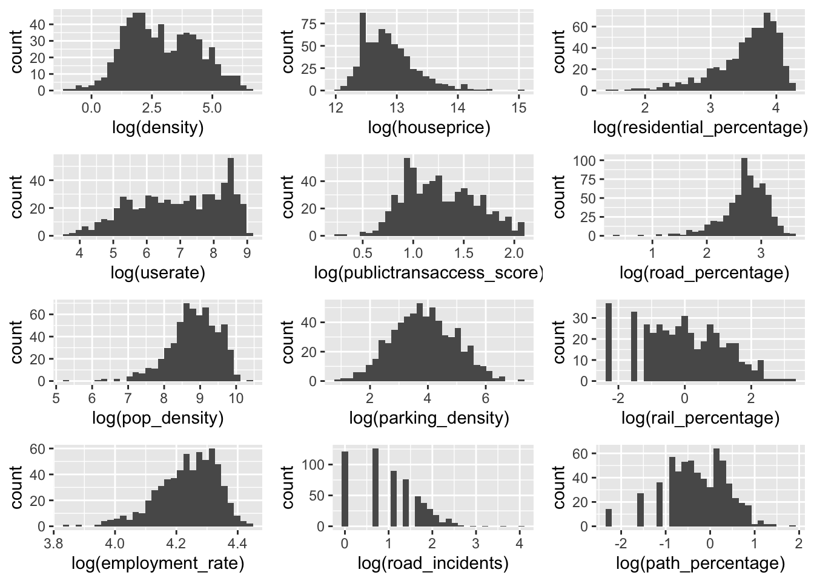

### Plot normal distribution


```r
multiplot(lp1, lp2, p3, p4, lp5, lp6, lp7, p9, p10, cols = 3)
```

```
## `stat_bin()` using `bins = 30`. Pick better value with `binwidth`.
## `stat_bin()` using `bins = 30`. Pick better value with `binwidth`.
## `stat_bin()` using `bins = 30`. Pick better value with `binwidth`.
## `stat_bin()` using `bins = 30`. Pick better value with `binwidth`.
## `stat_bin()` using `bins = 30`. Pick better value with `binwidth`.
## `stat_bin()` using `bins = 30`. Pick better value with `binwidth`.
## `stat_bin()` using `bins = 30`. Pick better value with `binwidth`.
## `stat_bin()` using `bins = 30`. Pick better value with `binwidth`.
## `stat_bin()` using `bins = 30`. Pick better value with `binwidth`.
```


### Independent variables


```r
independent <- characters %>% 
  dplyr::select(., c(1, 2, 3, 5, 6, 7, 8, 10, 11))
```

```r
colnames(independent)
```

```
## [1] "gss_code"                "density"                 "userate"                
## [4] "employment_rate"         "houseprice"              "publictransaccess_score"
## [7] "parking_density"         "residential_percentage"  "road_percentage"
```


## Correlation analysis

### Correlationship of userate & public transit of charge points in London

Remove possible outliers and plot the correlationship between these variables, comparing the charging density case and use rate case and finding the overall relationship. 


```r
qu1 <- qplot(x = `employment_rate`, 
             y = `userate`, 
             data=independent, 
             xlim = c(50, 85))

#plot with a regression line
qu1 <- qu1 + stat_smooth(method="lm", se=FALSE, size=1)
qd1 <- qplot(x = `employment_rate`, 
             y = `density`, 
             data=independent, 
             xlim = c(50, 85))

#plot with a regression line
qd1 <- qd1 + stat_smooth(method="lm", se=FALSE, size=1)
multiplot(qd1, qu1, cols = 2)
```

```
## `geom_smooth()` using formula 'y ~ x'
```

```
## Warning: Removed 2 rows containing non-finite values (stat_smooth).
```

```
## Warning: Removed 2 rows containing missing values (geom_point).
```

```
## `geom_smooth()` using formula 'y ~ x'
```

```
## Warning: Removed 2 rows containing non-finite values (stat_smooth).

## Warning: Removed 2 rows containing missing values (geom_point).
```

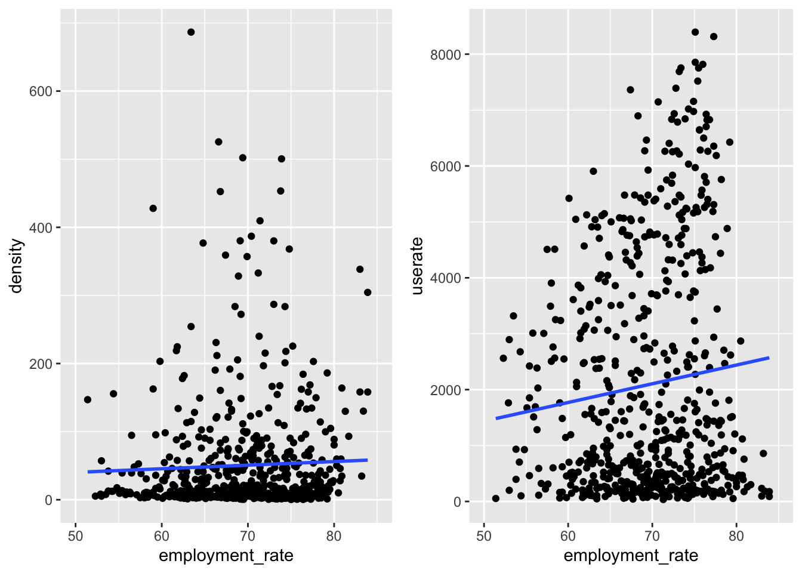

```r
qu2 <- qplot(x = `houseprice`, 
             y = `userate`, 
             data=independent, 
             xlim = c(250000, 800000))

#plot with a regression line
qu2 <- qu2 + stat_smooth(method="lm", se=FALSE, size=1) 
qd2 <- qplot(x = `houseprice`, 
             y = `density`,
             data=independent,
             xlim = c(250000, 800000))

#plot with a regression line
qd2 <- qd2 + stat_smooth(method="lm", se=FALSE, size=1) 
multiplot(qd2, qu2, cols = 2)
```

```
## `geom_smooth()` using formula 'y ~ x'
```

```
## Warning: Removed 119 rows containing non-finite values (stat_smooth).
```

```
## Warning: Removed 119 rows containing missing values (geom_point).
```

```
## `geom_smooth()` using formula 'y ~ x'
```

```
## Warning: Removed 119 rows containing non-finite values (stat_smooth).

## Warning: Removed 119 rows containing missing values (geom_point).
```

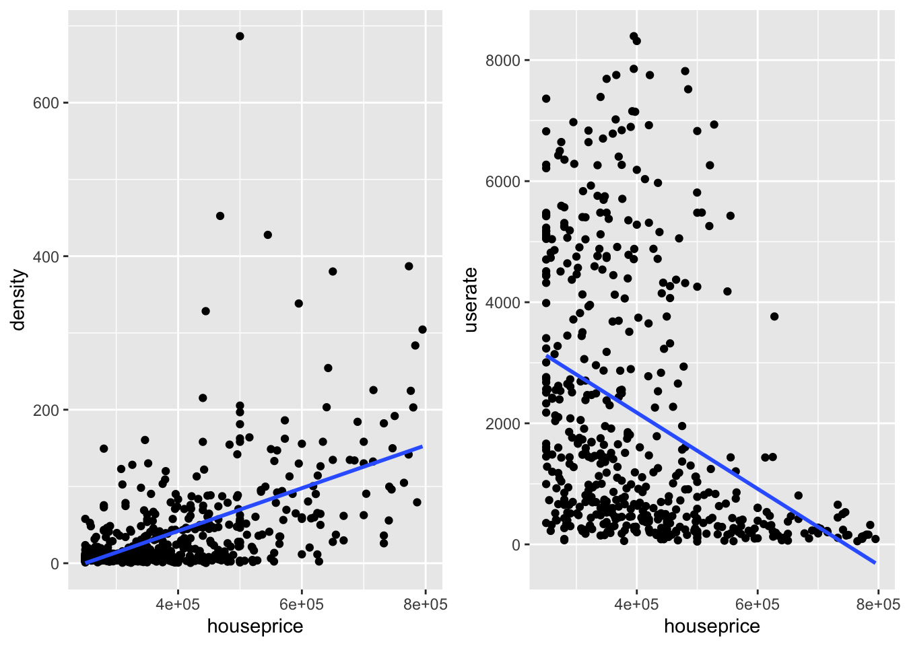

```r
qu3 <- qplot(x = `publictransaccess_score`, 
             y = `userate`, 
             data=independent)

#plot with a regression line
qu3 <- qu3 + stat_smooth(method="lm", se=FALSE, size=1) 
qd3 <- qplot(x = `publictransaccess_score`, 
             y = `density`, 
             data=independent)

#plot with a regression line
qd3 <- qd3 + stat_smooth(method="lm", se=FALSE, size=1)
multiplot(qd3, qu3, cols = 2)
```

```
## `geom_smooth()` using formula 'y ~ x'
## `geom_smooth()` using formula 'y ~ x'
```


```r
qu4 <- qplot(x = `parking_density`, 
             y = `userate`, 
             data=independent,
             xlim = c(0, 500))

#plot with a regression line
qu4 <- qu4 + stat_smooth(method="lm", se=FALSE, size=1)
qd4 <- qplot(x = `parking_density`, 
             y = `density`, 
             data=independent,
             xlim = c(0, 500))

#plot with a regression line
qd4 <- qd4 + stat_smooth(method="lm", se=FALSE, size=1)
multiplot(qd4, qu4, cols = 2)
```

```
## `geom_smooth()` using formula 'y ~ x'
```

```
## Warning: Removed 6 rows containing non-finite values (stat_smooth).
```

```
## Warning: Removed 6 rows containing missing values (geom_point).
```

```
## `geom_smooth()` using formula 'y ~ x'
```

```
## Warning: Removed 6 rows containing non-finite values (stat_smooth).

## Warning: Removed 6 rows containing missing values (geom_point).
```

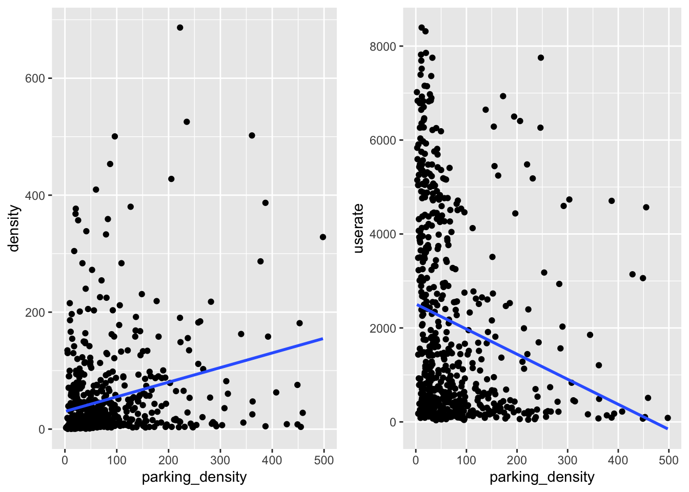

```r
qu5 <- qplot(x = `residential_percentage`, 
             y = `userate`, 
             data=independent)

#plot with a regression line
qu5 <- qu5 + stat_smooth(method="lm", se=FALSE, size=1)
qd5 <- qplot(x = `residential_percentage`, 
             y = `density`, 
             data=independent)

#plot with a regression line
qd5 <- qd5 + stat_smooth(method="lm", se=FALSE, size=1)
multiplot(qd5, qu5, cols = 2)
```

```
## `geom_smooth()` using formula 'y ~ x'
## `geom_smooth()` using formula 'y ~ x'
```

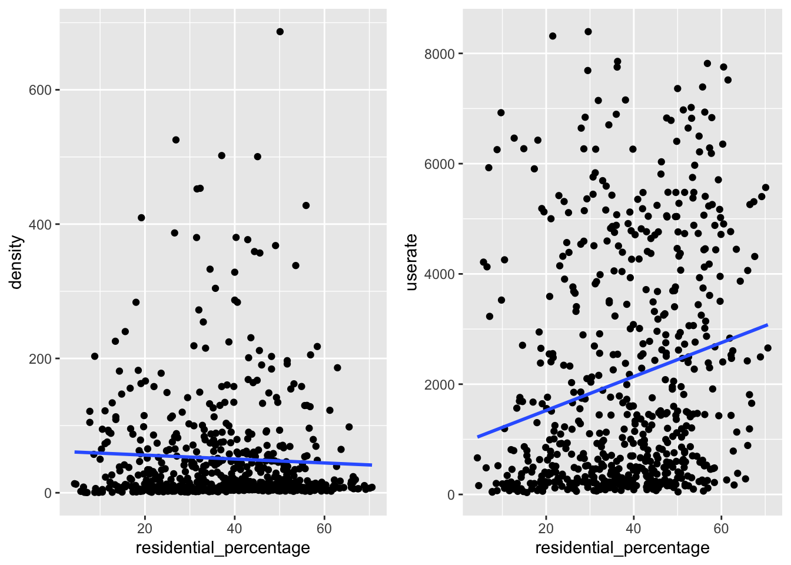

```r
qu6 <- qplot(x = `road_percentage`, 
             y = `userate`, 
             data=independent)

#plot with a regression line
qu6 <- qu6 + stat_smooth(method="lm", se=FALSE, size=1)
qd6 <- qplot(x = `road_percentage`, 
             y = `density`, 
             data=independent)

#plot with a regression line
qd6 <- qd6 + stat_smooth(method="lm", se=FALSE, size=1)
multiplot(qd6, qu6, cols = 2)
```

```
## `geom_smooth()` using formula 'y ~ x'
## `geom_smooth()` using formula 'y ~ x'
```


<!--chapter:end:04-correlation-analysis.Rmd-->


# Regression Analysis

In order to forecast charging facility location selection for future, the following part will compare the charge points registration distribution with other characteristics mentioned above, including land-use, travel-related and socio-demographic characteristics, applying ordinary least squares (OLS) regression models. In order to achieve higher accuracy for the results, Spatial Lag Model (SLM) which involves a separate spatially lagged variant of the dependent variable as an independent variable of the model, as well as Spatial Error Model (SEM) which incorporates a spatial lag of the OLS regression model’s residual as an independent variable, all participate in the comparison.

## Ordinary Least Squares (OLS) regression model

Find the specific relationship between those different variables


```r
# regression model
model1 <- lm(log(userate) ~
               employment_rate+
               log(houseprice)+
               log(publictransaccess_score)+
               log(parking_density)+
               residential_percentage+
               road_percentage, 
             data = independent)
```

```r
#show the summary of those outputs
summary(model1)
```

```
## 
## Call:
## lm(formula = log(userate) ~ employment_rate + log(houseprice) + 
##     log(publictransaccess_score) + log(parking_density) + residential_percentage + 
##     road_percentage, data = independent)
## 
## Residuals:
##     Min      1Q  Median      3Q     Max 
## -3.6909 -0.5438  0.0446  0.6646  2.4044 
## 
## Coefficients:
##                               Estimate Std. Error t value Pr(>|t|)    
## (Intercept)                  21.198355   1.151786  18.405  < 2e-16 ***
## employment_rate              -0.011648   0.006816  -1.709   0.0880 .  
## log(houseprice)              -0.922267   0.105108  -8.774  < 2e-16 ***
## log(publictransaccess_score) -1.096141   0.180330  -6.079 2.12e-09 ***
## log(parking_density)         -0.065196   0.035885  -1.817   0.0697 .  
## residential_percentage        0.025336   0.003101   8.171 1.73e-15 ***
## road_percentage              -0.056456   0.011857  -4.761 2.40e-06 ***
## ---
## Signif. codes:  0 '***' 0.001 '**' 0.01 '*' 0.05 '.' 0.1 ' ' 1
## 
## Residual standard error: 0.8738 on 618 degrees of freedom
## Multiple R-squared:  0.5763,	Adjusted R-squared:  0.5722 
## F-statistic: 140.1 on 6 and 618 DF,  p-value: < 2.2e-16
```

```r
glance(model1)
```

```
## # A tibble: 1 x 12
##   r.squared adj.r.squared sigma statistic   p.value    df logLik   AIC   BIC deviance df.residual
##       <dbl>         <dbl> <dbl>     <dbl>     <dbl> <dbl>  <dbl> <dbl> <dbl>    <dbl>       <int>
## 1     0.576         0.572 0.874      140. 9.44e-112     6  -799. 1614. 1649.     472.         618
## # … with 1 more variable: nobs <int>
```

```r
m1_tidy <- model1 %>% 
  tidy() 
m1_tidy
```

```
## # A tibble: 7 x 5
##   term                         estimate std.error statistic  p.value
##   <chr>                           <dbl>     <dbl>     <dbl>    <dbl>
## 1 (Intercept)                   21.2      1.15        18.4  1.21e-60
## 2 employment_rate               -0.0116   0.00682     -1.71 8.80e- 2
## 3 log(houseprice)               -0.922    0.105       -8.77 1.67e-17
## 4 log(publictransaccess_score)  -1.10     0.180       -6.08 2.12e- 9
## 5 log(parking_density)          -0.0652   0.0359      -1.82 6.97e- 2
## 6 residential_percentage         0.0253   0.00310      8.17 1.73e-15
## 7 road_percentage               -0.0565   0.0119      -4.76 2.40e- 6
```

```r
# regression model
model2 <- lm(log(density) ~ 
               employment_rate+
               log(houseprice)+
               log(publictransaccess_score)+
               log(parking_density)+
               residential_percentage+
               road_percentage, 
             data = characters)
```

```r
#show the summary of those outputs
summary(model2)
```

```
## 
## Call:
## lm(formula = log(density) ~ employment_rate + log(houseprice) + 
##     log(publictransaccess_score) + log(parking_density) + residential_percentage + 
##     road_percentage, data = characters)
## 
## Residuals:
##     Min      1Q  Median      3Q     Max 
## -2.7962 -0.6752 -0.0135  0.5784  3.8890 
## 
## Coefficients:
##                                Estimate Std. Error t value Pr(>|t|)    
## (Intercept)                  -14.161502   1.178311 -12.018  < 2e-16 ***
## employment_rate                0.014448   0.006973   2.072  0.03868 *  
## log(houseprice)                1.006913   0.107528   9.364  < 2e-16 ***
## log(publictransaccess_score)   1.101611   0.184483   5.971 3.97e-09 ***
## log(parking_density)           0.102071   0.036711   2.780  0.00559 ** 
## residential_percentage        -0.005205   0.003172  -1.641  0.10135    
## road_percentage                0.093916   0.012130   7.742 4.01e-14 ***
## ---
## Signif. codes:  0 '***' 0.001 '**' 0.01 '*' 0.05 '.' 0.1 ' ' 1
## 
## Residual standard error: 0.8939 on 618 degrees of freedom
## Multiple R-squared:  0.6348,	Adjusted R-squared:  0.6313 
## F-statistic: 179.1 on 6 and 618 DF,  p-value: < 2.2e-16
```

```r
glance(model2)
```

```
## # A tibble: 1 x 12
##   r.squared adj.r.squared sigma statistic   p.value    df logLik   AIC   BIC deviance df.residual
##       <dbl>         <dbl> <dbl>     <dbl>     <dbl> <dbl>  <dbl> <dbl> <dbl>    <dbl>       <int>
## 1     0.635         0.631 0.894      179. 1.24e-131     6  -813. 1642. 1678.     494.         618
## # … with 1 more variable: nobs <int>
```

## Assumptions Underpinning Linear Regression

### Assumption 1 - There is a linear relationship between the dependent and independent variables


```r
multiplot(lp1, lp2, p4, lp5, lp6, lp7, p9, p10, cols = 3)
```

```
## `stat_bin()` using `bins = 30`. Pick better value with `binwidth`.
## `stat_bin()` using `bins = 30`. Pick better value with `binwidth`.
## `stat_bin()` using `bins = 30`. Pick better value with `binwidth`.
## `stat_bin()` using `bins = 30`. Pick better value with `binwidth`.
## `stat_bin()` using `bins = 30`. Pick better value with `binwidth`.
## `stat_bin()` using `bins = 30`. Pick better value with `binwidth`.
## `stat_bin()` using `bins = 30`. Pick better value with `binwidth`.
## `stat_bin()` using `bins = 30`. Pick better value with `binwidth`.
```

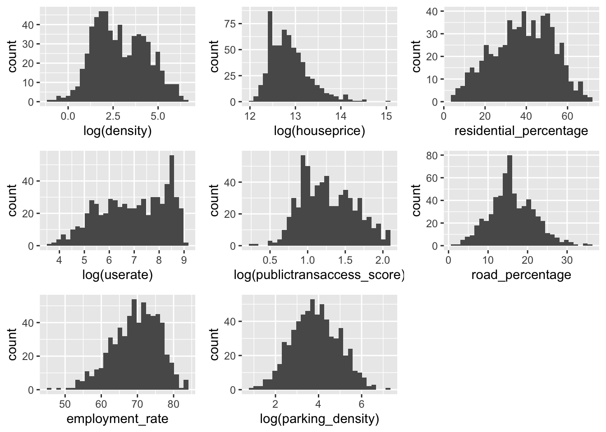

### Assumption 2 - The residuals in your model should be normally distributed


```r
#save the residuals into dataframe

model1_data <- model1 %>%
  augment(., independent)

#plot residuals
model1_data%>%
dplyr::select(.resid)%>%
  pull()%>%
  qplot()+ 
  geom_histogram() 
```

```
## `stat_bin()` using `bins = 30`. Pick better value with `binwidth`.
## `stat_bin()` using `bins = 30`. Pick better value with `binwidth`.
```

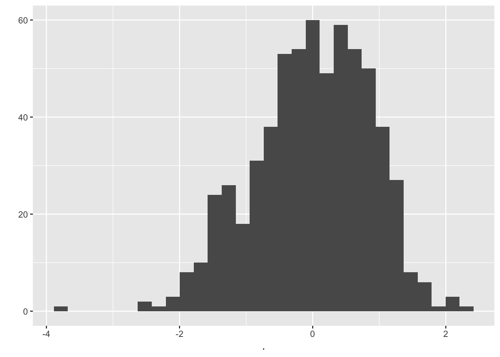

```r
#save the residuals into dataframe

model2_data <- model2 %>%
  augment(., independent)

#plot residuals
model2_data%>%
dplyr::select(.resid)%>%
  pull()%>%
  qplot()+ 
  geom_histogram() 
```

```
## `stat_bin()` using `bins = 30`. Pick better value with `binwidth`.
## `stat_bin()` using `bins = 30`. Pick better value with `binwidth`.
```

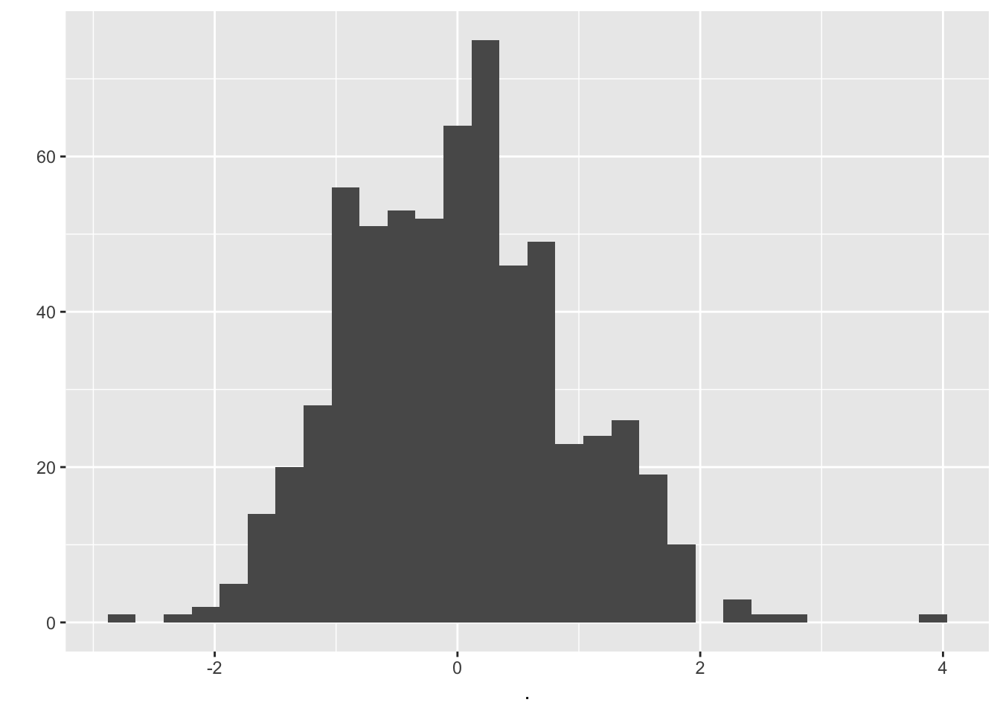


### Assumption 3 - No Multicolinearity in the independent variables


```r
position <- c(2:9)

Correlation_all<- independent %>%
  dplyr::select(position)%>%
    correlate()
```

```
## Note: Using an external vector in selections is ambiguous.
## ℹ Use `all_of(position)` instead of `position` to silence this message.
## ℹ See <https://tidyselect.r-lib.org/reference/faq-external-vector.html>.
## This message is displayed once per session.
```

```
## 
## Correlation method: 'pearson'
## Missing treated using: 'pairwise.complete.obs'
```

```r
Correlation_all
```

```
## # A tibble: 8 x 9
##   term  density userate employment_rate houseprice publictransacce… parking_density residential_per…
##   <chr>   <dbl>   <dbl>           <dbl>      <dbl>            <dbl>           <dbl>            <dbl>
## 1 dens… NA       -0.478          0.0314     0.549             0.569          0.279           -0.0500
## 2 user… -0.478   NA              0.109     -0.339            -0.557         -0.207            0.212 
## 3 empl…  0.0314   0.109         NA          0.153            -0.186         -0.0851           0.267 
## 4 hous…  0.549   -0.339          0.153     NA                 0.463          0.0805          -0.100 
## 5 publ…  0.569   -0.557         -0.186      0.463            NA              0.303           -0.175 
## 6 park…  0.279   -0.207         -0.0851     0.0805            0.303         NA               -0.0907
## 7 resi… -0.0500   0.212          0.267     -0.100            -0.175         -0.0907          NA     
## 8 road…  0.579   -0.464         -0.224      0.342             0.761          0.298            0.215 
## # … with 1 more variable: road_percentage <dbl>
```

```r
position <- c(4:9)

Correlation<- independent %>%
  dplyr::select(position)%>%
  dplyr::rename(ER="employment_rate",
         HP="houseprice",
         PS="publictransaccess_score",
         PD="parking_density",
         RSP="residential_percentage",
         RP="road_percentage"
         ) %>% 
    correlate()
```

```
## 
## Correlation method: 'pearson'
## Missing treated using: 'pairwise.complete.obs'
```

```r
r <- rplot(Correlation, shape = 15,colours = c("skyblue1", "white", "indianred2"))
r
```

```
## Don't know how to automatically pick scale for object of type noquote. Defaulting to continuous.
```

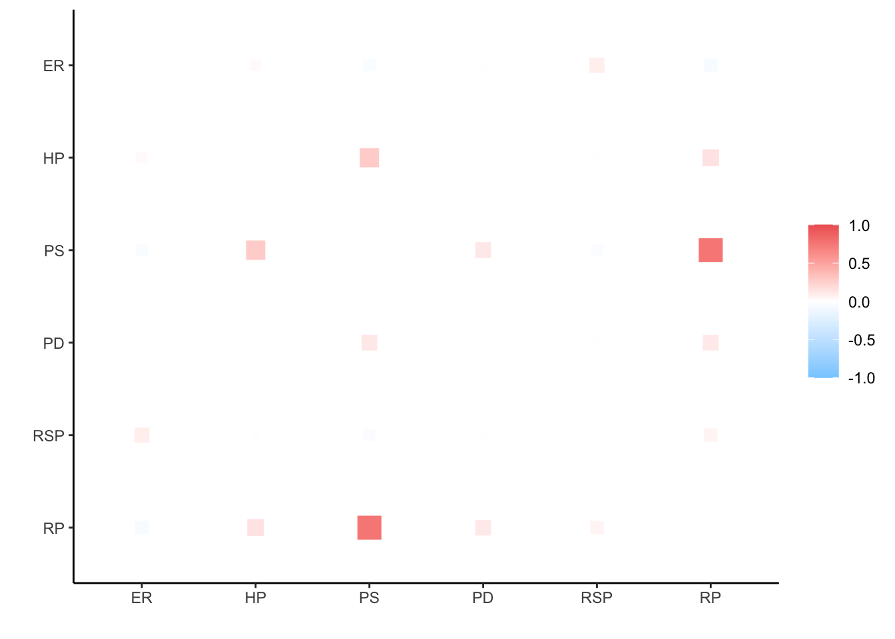

```r
png(filename = "pic/correlation.png", 
    width = 500, height = 500)     
r
```

```
## Don't know how to automatically pick scale for object of type noquote. Defaulting to continuous.
```

```r
dev.off()
```

```
## quartz_off_screen 
##                 2
```


### Assumption 4 - Homoscedasticity


```r
par(mfrow=c(2,2)) 
plot(model1)
```

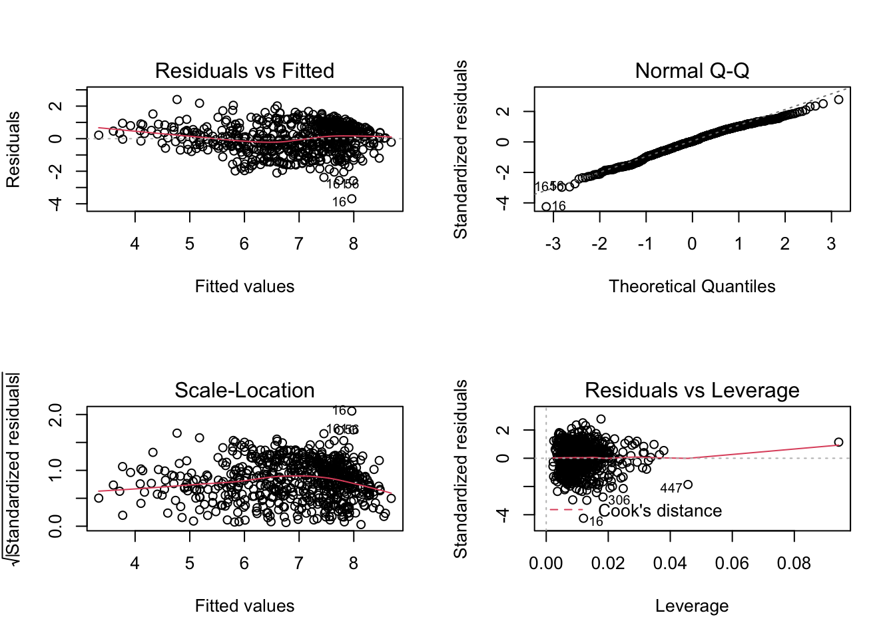

```r
par(mfrow=c(2,2)) 
plot(model2)
```

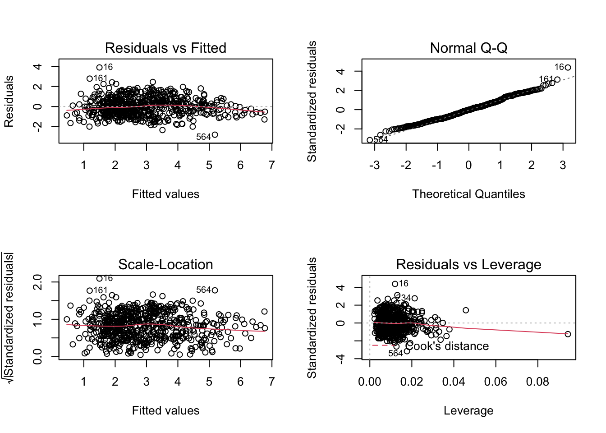

### Assumption 5 - Independence of Errors


```r
#run durbin-watson test m1
DW1 <- durbinWatsonTest(model1)
tidy(DW1)
```

```
## # A tibble: 1 x 5
##   statistic p.value autocorrelation method             alternative
##       <dbl>   <dbl>           <dbl> <chr>              <chr>      
## 1      1.66       0           0.170 Durbin-Watson Test two.sided
```


```r
#run durbin-watson test m2
DW2 <- durbinWatsonTest(model2)
tidy(DW2)
```

```
## # A tibble: 1 x 5
##   statistic p.value autocorrelation method             alternative
##       <dbl>   <dbl>           <dbl> <chr>              <chr>      
## 1      1.58       0           0.207 Durbin-Watson Test two.sided
```


```r
residuals <- londonwards %>% 
  mutate(model1residual = residuals(model1)) %>% 
  mutate(model2residual = residuals(model2))
```


```r
#plot the residuals m1
tmap_mode("view")
```

```
## tmap mode set to interactive viewing
```

```r
qtm(residuals, fill = "model1residual")
```

```
## Variable(s) "model1residual" contains positive and negative values, so midpoint is set to 0. Set midpoint = NA to show the full spectrum of the color palette.
```

preserve01556da343063cbd

```r
#plot the residuals m2
tmap_mode("view")
```

```
## tmap mode set to interactive viewing
```

```r
qtm(residuals, fill = "model2residual")
```

```
## Variable(s) "model2residual" contains positive and negative values, so midpoint is set to 0. Set midpoint = NA to show the full spectrum of the color palette.
```

preserve2dbe7b25e75e3308

### Moran's I test for residuals (generally)


```r
coordsW <- residuals %>% 
    st_centroid() %>%
    st_geometry()
```

```
## Warning in st_centroid.sf(.): st_centroid assumes attributes are constant over geometries of x
```

```r
# queen
queen_nb <- residuals %>%
  poly2nb(., queen=T)

# k nearest neighbours
knn_nb <-coordsW %>%
  knearneigh(., k=9)%>%
  knn2nb()
```


```r
#create spatial weights matrix 

queens_weight <- queen_nb %>%
  nb2listw(., style="C")

knn_weight <- knn_nb %>%
  nb2listw(., style="C")
```


```r
Queen1 <- residuals %>%
  st_drop_geometry()%>%
  dplyr::select(model1residual)%>%
  pull()%>%
  moran.test(., queens_weight)%>%
  tidy()
Queen1
```

```
## # A tibble: 1 x 7
##   estimate1 estimate2 estimate3 statistic p.value method                           alternative
##       <dbl>     <dbl>     <dbl>     <dbl>   <dbl> <chr>                            <chr>      
## 1    0.0477  -0.00160  0.000538      2.13  0.0168 Moran I test under randomisation greater
```


```r
Knn1 <- residuals %>%
  st_drop_geometry()%>%
  dplyr::select(model1residual)%>%
  pull()%>%
  moran.test(., knn_weight)%>%
  tidy()
Knn1
```

```
## # A tibble: 1 x 7
##   estimate1 estimate2 estimate3 statistic  p.value method                           alternative
##       <dbl>     <dbl>     <dbl>     <dbl>    <dbl> <chr>                            <chr>      
## 1    0.0647  -0.00160  0.000324      3.69 0.000113 Moran I test under randomisation greater
```


```r
Queen2 <- residuals %>%
  st_drop_geometry()%>%
  dplyr::select(model2residual)%>%
  pull()%>%
  moran.test(., queens_weight)%>%
  tidy()
Queen2
```

```
## # A tibble: 1 x 7
##   estimate1 estimate2 estimate3 statistic  p.value method                           alternative
##       <dbl>     <dbl>     <dbl>     <dbl>    <dbl> <chr>                            <chr>      
## 1    0.0726  -0.00160  0.000538      3.20 0.000685 Moran I test under randomisation greater
```


```r
Knn2 <- residuals %>%
  st_drop_geometry()%>%
  dplyr::select(model2residual)%>%
  pull()%>%
  moran.test(., knn_weight)%>%
  tidy()
Knn2
```

```
## # A tibble: 1 x 7
##   estimate1 estimate2 estimate3 statistic     p.value method                           alternative
##       <dbl>     <dbl>     <dbl>     <dbl>       <dbl> <chr>                            <chr>      
## 1    0.0870  -0.00160  0.000323      4.93 0.000000415 Moran I test under randomisation greater
```

## Spatial Regression Models

### Spatial Lag models for Model 1 (queen)


```r
lag_model1_queen <- lagsarlm(log(userate) ~
                               employment_rate+
                               log(houseprice)+
                               log(publictransaccess_score)+
                               log(parking_density)+
                               residential_percentage+
                               road_percentage,
                             data = independent, 
                             nb2listw(queen_nb, style="C"), 
                             method = "eigen")

tidy(lag_model1_queen)
```

```
## # A tibble: 8 x 5
##   term                         estimate std.error statistic  p.value
##   <chr>                           <dbl>     <dbl>     <dbl>    <dbl>
## 1 rho                            0.0313   0.0188       1.67 9.54e- 2
## 2 (Intercept)                   20.8      1.17        17.7  0.      
## 3 employment_rate               -0.0123   0.00678     -1.82 6.93e- 2
## 4 log(houseprice)               -0.905    0.105       -8.63 0.      
## 5 log(publictransaccess_score)  -1.08     0.179       -6.05 1.43e- 9
## 6 log(parking_density)          -0.0609   0.0357      -1.70 8.83e- 2
## 7 residential_percentage         0.0252   0.00308      8.20 2.22e-16
## 8 road_percentage               -0.0560   0.0118      -4.76 1.93e- 6
```

```r
glance(lag_model1_queen)
```

```
## # A tibble: 1 x 6
##   r.squared   AIC   BIC deviance logLik  nobs
##       <dbl> <dbl> <dbl>    <dbl>  <dbl> <int>
## 1     0.578 1613. 1653.     470.  -798.   625
```

### Spatial Lag models for Model 2 (queen)


```r
lag_model2_queen <- lagsarlm(log(density) ~
                               employment_rate+
                               log(houseprice)+
                               log(publictransaccess_score)+
                               log(parking_density)+
                               residential_percentage+
                               road_percentage,
                             data = independent, 
                             nb2listw(queen_nb, style="C"), 
                             method = "eigen")

tidy(lag_model2_queen)
```

```
## # A tibble: 8 x 5
##   term                          estimate std.error statistic  p.value
##   <chr>                            <dbl>     <dbl>     <dbl>    <dbl>
## 1 rho                            0.0725    0.0323       2.24 2.48e- 2
## 2 (Intercept)                  -13.6       1.20       -11.4  0.      
## 3 employment_rate                0.0141    0.00690      2.05 4.08e- 2
## 4 log(houseprice)                0.955     0.109        8.73 0.      
## 5 log(publictransaccess_score)   1.07      0.183        5.82 6.05e- 9
## 6 log(parking_density)           0.104     0.0363       2.85 4.35e- 3
## 7 residential_percentage        -0.00437   0.00315     -1.39 1.65e- 1
## 8 road_percentage                0.0902    0.0121       7.47 8.06e-14
```

```r
glance(lag_model2_queen)
```

```
## # A tibble: 1 x 6
##   r.squared   AIC   BIC deviance logLik  nobs
##       <dbl> <dbl> <dbl>    <dbl>  <dbl> <int>
## 1     0.638 1639. 1679.     489.  -811.   625
```

### Spatial Error models for Model 1 (queen)


```r
error_model1_queen <- errorsarlm(log(userate) ~
                                   employment_rate+
                                   log(houseprice)+
                                   log(publictransaccess_score)+
                                   log(parking_density)+
                                   residential_percentage+
                                   road_percentage,
                                 data = independent, 
                                 nb2listw(queen_nb, style="C"), 
                                 method = "eigen")

tidy(error_model1_queen)
```

```
## # A tibble: 8 x 5
##   term                         estimate std.error statistic  p.value
##   <chr>                           <dbl>     <dbl>     <dbl>    <dbl>
## 1 (Intercept)                   21.3      1.17        18.2  0.      
## 2 employment_rate               -0.0104   0.00685     -1.51 1.30e- 1
## 3 log(houseprice)               -0.938    0.106       -8.81 0.      
## 4 log(publictransaccess_score)  -1.08     0.180       -6.03 1.65e- 9
## 5 log(parking_density)          -0.0728   0.0359      -2.03 4.24e- 2
## 6 residential_percentage         0.0244   0.00309      7.90 2.66e-15
## 7 road_percentage               -0.0540   0.0118      -4.60 4.32e- 6
## 8 lambda                         0.127    0.0651       1.95 5.14e- 2
```

```r
glance(error_model1_queen)
```

```
## # A tibble: 1 x 6
##   r.squared   AIC   BIC deviance logLik  nobs
##       <dbl> <dbl> <dbl>    <dbl>  <dbl> <int>
## 1     0.580 1612. 1652.     468.  -797.   625
```

### Spatial Error models for Model 2 (queen)


```r
error_model2_queen <- errorsarlm(log(density) ~
                                   employment_rate+
                                   log(houseprice)+
                                   log(publictransaccess_score)+
                                   log(parking_density)+
                                   residential_percentage+
                                   road_percentage,
                                 data = independent, 
                                 nb2listw(queen_nb, style="C"), 
                                 method = "eigen")

tidy(error_model2_queen)
```

```
## # A tibble: 8 x 5
##   term                          estimate std.error statistic  p.value
##   <chr>                            <dbl>     <dbl>     <dbl>    <dbl>
## 1 (Intercept)                  -14.2       1.21       -11.7  0.      
## 2 employment_rate                0.0123    0.00701      1.75 7.95e- 2
## 3 log(houseprice)                1.02      0.109        9.34 0.      
## 4 log(publictransaccess_score)   1.09      0.183        5.93 2.95e- 9
## 5 log(parking_density)           0.109     0.0366       2.98 2.85e- 3
## 6 residential_percentage        -0.00358   0.00315     -1.14 2.56e- 1
## 7 road_percentage                0.0895    0.0120       7.49 6.99e-14
## 8 lambda                         0.185     0.0632       2.94 3.33e- 3
```

```r
glance(error_model2_queen)
```

```
## # A tibble: 1 x 6
##   r.squared   AIC   BIC deviance logLik  nobs
##       <dbl> <dbl> <dbl>    <dbl>  <dbl> <int>
## 1     0.642 1636. 1676.     484.  -809.   625
```


### Find best k for KNN strategy

Use for loop to find the best k (1 to 10) for those Spatial Regression Models, and summarize the best k values, corresponding R-squared and AIC, so that they can be compared and the better results can be identified for further analysis.

#### The k for Spatial Lag Model 1


```r
r_squared <- list()
best_k <- list()
AIC <- list()
# create empty variable to store fit
k <- NA
a <- NA
  
# run the k-means 10 times
for (i in 1:10){
  
  # keep track of the runs
  print(paste0('starting run: k = ', i))
  coordsW <- residuals %>% 
    st_centroid() %>%
    st_geometry()
  knn_nb <-coordsW %>%
  knearneigh(., k=i)%>%
  knn2nb()
  
  knn_weight <- knn_nb %>%
  nb2listw(., style="C")
  
  lag_model1_knni <- lagsarlm(log(userate) ~
                              employment_rate+
                              log(houseprice)+
                              log(publictransaccess_score)+
                              log(parking_density)+
                              residential_percentage+
                              road_percentage,
                            data = independent, 
                            nb2listw(knn_nb, style="C"), 
                            method = "eigen")

  k[i] <- glance(lag_model1_knni)[[1]]
  a[i] <- glance(lag_model1_knni)[[2]]
  
  # update the results of the clustering if the total within sum of squares for the run
  # is lower than any of the runs that have been executed so far 
  if (k[i] > max (k[1:(i-1)])){
    r_squared <- k[i]
    best_k <- i
    AIC <- a[i]}
}
```

```
## [1] "starting run: k = 1"
```

```
## Warning in st_centroid.sf(.): st_centroid assumes attributes are constant over geometries of x
```

```
## [1] "starting run: k = 2"
```

```
## Warning in st_centroid.sf(.): st_centroid assumes attributes are constant over geometries of x
```

```
## [1] "starting run: k = 3"
```

```
## Warning in st_centroid.sf(.): st_centroid assumes attributes are constant over geometries of x
```

```
## [1] "starting run: k = 4"
```

```
## Warning in st_centroid.sf(.): st_centroid assumes attributes are constant over geometries of x
```

```
## [1] "starting run: k = 5"
```

```
## Warning in st_centroid.sf(.): st_centroid assumes attributes are constant over geometries of x
```

```
## [1] "starting run: k = 6"
```

```
## Warning in st_centroid.sf(.): st_centroid assumes attributes are constant over geometries of x
```

```
## [1] "starting run: k = 7"
```

```
## Warning in st_centroid.sf(.): st_centroid assumes attributes are constant over geometries of x
```

```
## [1] "starting run: k = 8"
```

```
## Warning in st_centroid.sf(.): st_centroid assumes attributes are constant over geometries of x
```

```
## [1] "starting run: k = 9"
```

```
## Warning in st_centroid.sf(.): st_centroid assumes attributes are constant over geometries of x
```

```
## [1] "starting run: k = 10"
```

```
## Warning in st_centroid.sf(.): st_centroid assumes attributes are constant over geometries of x
```

```r
r_squared 
```

```
## [1] 0.5846022
```

```r
best_k 
```

```
## [1] 7
```

```r
AIC
```

```
## [1] 1605.435
```

#### The k for Spatial Lag Model 2


```r
r_squared2 <- list()
best_k2 <- list()
AIC2 <- list()
# create empty variable to store fit
k <- NA
a <- NA
  
# run the k-means 10 times
for (i in 1:10){
  
  # keep track of the runs
  print(paste0('starting run: k = ', i))
  coordsW <- residuals %>% 
    st_centroid() %>%
    st_geometry()
  knn_nb <-coordsW %>%
  knearneigh(., k=i)%>%
  knn2nb()
  
  knn_weight <- knn_nb %>%
  nb2listw(., style="C")
  
  lag_model2_knni <- lagsarlm(log(density) ~
                              employment_rate+
                              log(houseprice)+
                              log(publictransaccess_score)+
                              log(parking_density)+
                              residential_percentage+
                              road_percentage,
                            data = independent, 
                            nb2listw(knn_nb, style="C"), 
                            method = "eigen")

  k[i] <- glance(lag_model2_knni)[[1]]
  a[i] <- glance(lag_model2_knni)[[2]]
  
  # update the results of the clustering if the total within sum of squares for the run
  # is lower than any of the runs that have been executed so far 
  if (k[i] > max (k[1:(i-1)])){
    r_squared2 <- k[i]
    best_k2 <- i
    AIC2 <- a[i]}
}
```

```
## [1] "starting run: k = 1"
```

```
## Warning in st_centroid.sf(.): st_centroid assumes attributes are constant over geometries of x
```

```
## [1] "starting run: k = 2"
```

```
## Warning in st_centroid.sf(.): st_centroid assumes attributes are constant over geometries of x
```

```
## [1] "starting run: k = 3"
```

```
## Warning in st_centroid.sf(.): st_centroid assumes attributes are constant over geometries of x
```

```
## [1] "starting run: k = 4"
```

```
## Warning in st_centroid.sf(.): st_centroid assumes attributes are constant over geometries of x
```

```
## [1] "starting run: k = 5"
```

```
## Warning in st_centroid.sf(.): st_centroid assumes attributes are constant over geometries of x
```

```
## [1] "starting run: k = 6"
```

```
## Warning in st_centroid.sf(.): st_centroid assumes attributes are constant over geometries of x
```

```
## [1] "starting run: k = 7"
```

```
## Warning in st_centroid.sf(.): st_centroid assumes attributes are constant over geometries of x
```

```
## [1] "starting run: k = 8"
```

```
## Warning in st_centroid.sf(.): st_centroid assumes attributes are constant over geometries of x
```

```
## [1] "starting run: k = 9"
```

```
## Warning in st_centroid.sf(.): st_centroid assumes attributes are constant over geometries of x
```

```
## [1] "starting run: k = 10"
```

```
## Warning in st_centroid.sf(.): st_centroid assumes attributes are constant over geometries of x
```

```r
r_squared2
```

```
## [1] 0.6466878
```

```r
best_k2 
```

```
## [1] 7
```

```r
AIC2
```

```
## [1] 1626.565
```


#### The k for Spatial Error Model 1


```r
r_squared3 <- list()
best_k3 <- list()
AIC3 <- list()
# create empty variable to store fit
k <- NA
a <- NA
  
# run the k-means 10 times
for (i in 1:10){
  
  # keep track of the runs
  print(paste0('starting run: k = ', i))
  coordsW <- residuals %>% 
    st_centroid() %>%
    st_geometry()
  knn_nb <-coordsW %>%
  knearneigh(., k=i)%>%
  knn2nb()
  
  knn_weight <- knn_nb %>%
  nb2listw(., style="C")
  
  error_model1_knni <- errorsarlm(log(userate) ~
                                  employment_rate+
                                  log(houseprice)+
                                  log(publictransaccess_score)+
                                  log(parking_density)+
                                  residential_percentage+
                                  road_percentage,
                                data = independent, 
                                nb2listw(knn_nb, style="C"), 
                                method = "eigen")

  k[i] <- glance(error_model1_knni)[[1]]
  a[i] <- glance(error_model1_knni)[[2]]
  
  # update the results of the clustering if the total within sum of squares for the run
  # is lower than any of the runs that have been executed so far 
  if (k[i] > max (k[1:(i-1)])){
    r_squared3 <- k[i]
    best_k3 <- i
    AIC3 <- a[i]}
}
```

```
## [1] "starting run: k = 1"
```

```
## Warning in st_centroid.sf(.): st_centroid assumes attributes are constant over geometries of x
```

```
## [1] "starting run: k = 2"
```

```
## Warning in st_centroid.sf(.): st_centroid assumes attributes are constant over geometries of x
```

```
## [1] "starting run: k = 3"
```

```
## Warning in st_centroid.sf(.): st_centroid assumes attributes are constant over geometries of x
```

```
## [1] "starting run: k = 4"
```

```
## Warning in st_centroid.sf(.): st_centroid assumes attributes are constant over geometries of x
```

```
## [1] "starting run: k = 5"
```

```
## Warning in st_centroid.sf(.): st_centroid assumes attributes are constant over geometries of x
```

```
## [1] "starting run: k = 6"
```

```
## Warning in st_centroid.sf(.): st_centroid assumes attributes are constant over geometries of x
```

```
## [1] "starting run: k = 7"
```

```
## Warning in st_centroid.sf(.): st_centroid assumes attributes are constant over geometries of x
```

```
## [1] "starting run: k = 8"
```

```
## Warning in st_centroid.sf(.): st_centroid assumes attributes are constant over geometries of x
```

```
## [1] "starting run: k = 9"
```

```
## Warning in st_centroid.sf(.): st_centroid assumes attributes are constant over geometries of x
```

```
## [1] "starting run: k = 10"
```

```
## Warning in st_centroid.sf(.): st_centroid assumes attributes are constant over geometries of x
```

```r
r_squared3
```

```
## [1] 0.5860321
```

```r
best_k3 
```

```
## [1] 9
```

```r
AIC3
```

```
## [1] 1605.57
```

#### The k for Spatial Error Model 2


```r
r_squared4 <- list()
best_k4 <- list()
AIC4 <- list()
# create empty variable to store fit
k <- NA
a <- NA
  
# run the k-means 10 times
for (i in 1:10){
  
  # keep track of the runs
  print(paste0('starting run: k = ', i))
  coordsW <- residuals %>% 
    st_centroid() %>%
    st_geometry()
  knn_nb <-coordsW %>%
  knearneigh(., k=i)%>%
  knn2nb()
  
  knn_weight <- knn_nb %>%
  nb2listw(., style="C")
  
  error_model2_knni <- errorsarlm(log(density) ~
                                  employment_rate+
                                  log(houseprice)+
                                  log(publictransaccess_score)+
                                  log(parking_density)+
                                  residential_percentage+
                                  road_percentage,
                                data = independent, 
                                nb2listw(knn_nb, style="C"), 
                                method = "eigen")

  k[i] <- glance(error_model2_knni)[[1]]
  a[i] <- glance(error_model2_knni)[[2]]
  
  # update the results of the clustering if the total within sum of squares for the run
  # is lower than any of the runs that have been executed so far 
  if (k[i] > max (k[1:(i-1)])){
    r_squared4 <- k[i]
    best_k4 <- i
    AIC4 <- a[i]}
}
```

```
## [1] "starting run: k = 1"
```

```
## Warning in st_centroid.sf(.): st_centroid assumes attributes are constant over geometries of x
```

```
## [1] "starting run: k = 2"
```

```
## Warning in st_centroid.sf(.): st_centroid assumes attributes are constant over geometries of x
```

```
## [1] "starting run: k = 3"
```

```
## Warning in st_centroid.sf(.): st_centroid assumes attributes are constant over geometries of x
```

```
## [1] "starting run: k = 4"
```

```
## Warning in st_centroid.sf(.): st_centroid assumes attributes are constant over geometries of x
```

```
## [1] "starting run: k = 5"
```

```
## Warning in st_centroid.sf(.): st_centroid assumes attributes are constant over geometries of x
```

```
## [1] "starting run: k = 6"
```

```
## Warning in st_centroid.sf(.): st_centroid assumes attributes are constant over geometries of x
```

```
## [1] "starting run: k = 7"
```

```
## Warning in st_centroid.sf(.): st_centroid assumes attributes are constant over geometries of x
```

```
## [1] "starting run: k = 8"
```

```
## Warning in st_centroid.sf(.): st_centroid assumes attributes are constant over geometries of x
```

```
## [1] "starting run: k = 9"
```

```
## Warning in st_centroid.sf(.): st_centroid assumes attributes are constant over geometries of x
```

```
## [1] "starting run: k = 10"
```

```
## Warning in st_centroid.sf(.): st_centroid assumes attributes are constant over geometries of x
```

```r
r_squared4 
```

```
## [1] 0.6491493
```

```r
best_k4 
```

```
## [1] 9
```

```r
AIC4
```

```
## [1] 1626.477
```


### Spatial Error models for Model 1 (KNN; k=9)


```r
error_model1_knn9 <- errorsarlm(log(userate) ~
                                  employment_rate+
                                  log(houseprice)+
                                  log(publictransaccess_score)+
                                  log(parking_density)+
                                  residential_percentage+
                                  road_percentage,
                                data = independent, 
                                nb2listw(knn_nb, style="C"), 
                                method = "eigen")

tidy(error_model1_knn9)
```

```
## # A tibble: 8 x 5
##   term                         estimate std.error statistic  p.value
##   <chr>                           <dbl>     <dbl>     <dbl>    <dbl>
## 1 (Intercept)                  21.3       1.20        17.8  0.      
## 2 employment_rate              -0.00991   0.00686     -1.44 1.49e- 1
## 3 log(houseprice)              -0.940     0.108       -8.67 0.      
## 4 log(publictransaccess_score) -1.10      0.179       -6.13 8.71e-10
## 5 log(parking_density)         -0.0774    0.0358      -2.16 3.06e- 2
## 6 residential_percentage        0.0238    0.00309      7.70 1.38e-14
## 7 road_percentage              -0.0523    0.0117      -4.46 8.16e- 6
## 8 lambda                        0.241     0.0805       2.99 2.77e- 3
```

```r
glance(error_model1_knn9)
```

```
## # A tibble: 1 x 6
##   r.squared   AIC   BIC deviance logLik  nobs
##       <dbl> <dbl> <dbl>    <dbl>  <dbl> <int>
## 1     0.585 1607. 1647.     463.  -794.   625
```

```r
error_model2_knn9 <- errorsarlm(log(density) ~
                                  employment_rate+
                                  log(houseprice)+
                                  log(publictransaccess_score)+
                                  log(parking_density)+
                                  residential_percentage+
                                  road_percentage,
                                data = independent, 
                                nb2listw(knn_nb, style="C"), 
                                method = "eigen")

tidy(error_model2_knn9)
```

```
## # A tibble: 8 x 5
##   term                          estimate std.error statistic  p.value
##   <chr>                            <dbl>     <dbl>     <dbl>    <dbl>
## 1 (Intercept)                  -14.0       1.24      -11.4   0.      
## 2 employment_rate                0.0121    0.00701     1.72  8.52e- 2
## 3 log(houseprice)                1.01      0.111       9.05  0.      
## 4 log(publictransaccess_score)   1.11      0.183       6.07  1.30e- 9
## 5 log(parking_density)           0.112     0.0364      3.07  2.12e- 3
## 6 residential_percentage        -0.00298   0.00315    -0.948 3.43e- 1
## 7 road_percentage                0.0880    0.0119      7.38  1.55e-13
## 8 lambda                         0.307     0.0766      4.01  6.18e- 5
```

```r
glance(error_model2_knn9)
```

```
## # A tibble: 1 x 6
##   r.squared   AIC   BIC deviance logLik  nobs
##       <dbl> <dbl> <dbl>    <dbl>  <dbl> <int>
## 1     0.647 1629. 1669.     477.  -805.   625
```

#### Check residuals

Check wether the residuals of the better model still show spatial correlation. 


```r
# residuals for spatial error model 1

residuals <- residuals %>%
  mutate(error_model1_knn9_resids = residuals(error_model1_knn9))

ErrorMoran1 <- residuals %>%
  st_drop_geometry()%>%
  dplyr::select(error_model1_knn9_resids)%>%
  pull()%>%
  moran.test(., knn_weight)%>%
  tidy()

ErrorMoran1
```

```
## # A tibble: 1 x 7
##   estimate1 estimate2 estimate3 statistic p.value method                           alternative
##       <dbl>     <dbl>     <dbl>     <dbl>   <dbl> <chr>                            <chr>      
## 1  -0.00487  -0.00160  0.000291    -0.192   0.576 Moran I test under randomisation greater
```


```r
# residuals for spatial error model 2

residuals <- residuals %>%
  mutate(error_model2_knn9_resids = residuals(error_model2_knn9))

ErrorMoran2 <- residuals %>%
  st_drop_geometry()%>%
  dplyr::select(error_model2_knn9_resids)%>%
  pull()%>%
  moran.test(., knn_weight)%>%
  tidy()

ErrorMoran2
```

```
## # A tibble: 1 x 7
##   estimate1 estimate2 estimate3 statistic p.value method                           alternative
##       <dbl>     <dbl>     <dbl>     <dbl>   <dbl> <chr>                            <chr>      
## 1  -0.00716  -0.00160  0.000291    -0.326   0.628 Moran I test under randomisation greater
```


<!--chapter:end:05-regression-analysis.Rmd-->

